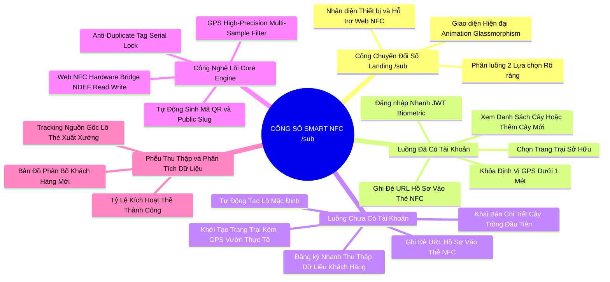
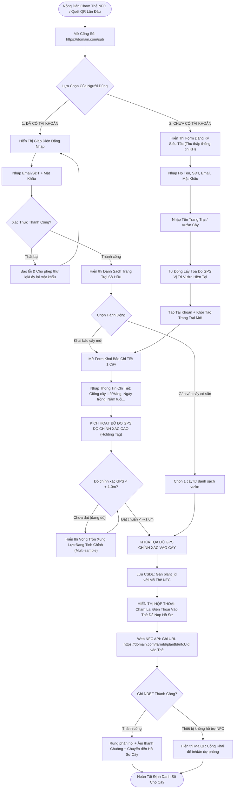
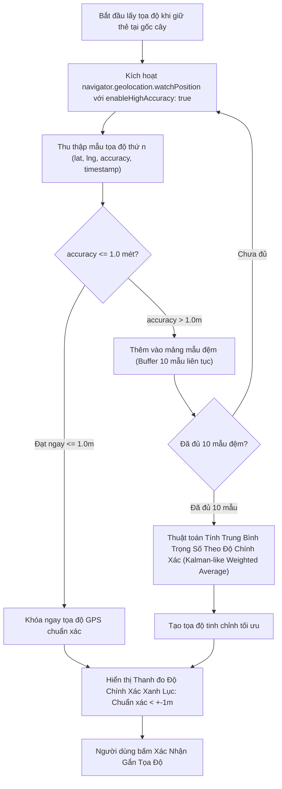
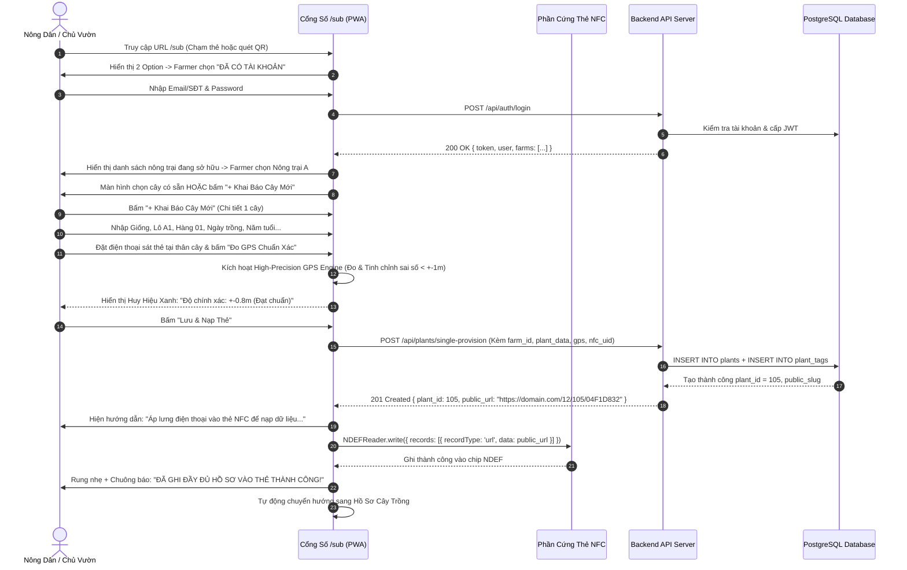
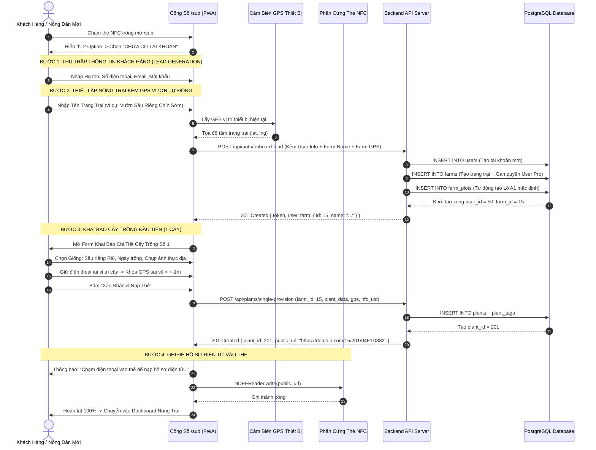
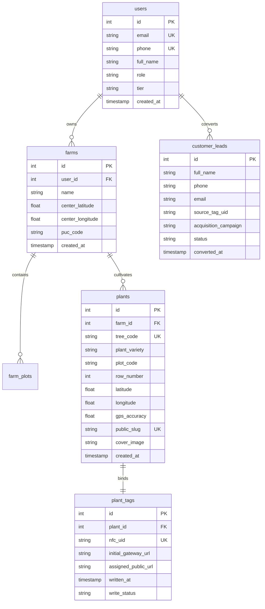

# 🌿 SỔ NÔNG TÂN BẢO AGTECH (PLANT BOOK)
# 🚀 BẢN THIẾT KẾ KIẾN TRÚC & KẾ HOẠCH TRIỂN KHAI TOÀN DIỆN
## CỔNG SỐ ĐỊNH DANH CÂY TRỒNG & THU THẬP DỮ LIỆU KHÁCH HÀNG TẬP TRUNG (`domain/sub`)
### HỆ THỐNG SMART NFC TAG ONBOARDING & HIGH-PRECISION GPS PROVISIONING GATEWAY

> **Tân Bảo Sài Gòn Corp (TBSG AgTech)** · Phiên bản: **2.3.0 Smart NFC Gateway Edition**  
> Ngày lập: **02/10/2026** · Trạng thái: **Đang Triển Khai (Active Implementation)**

---

## 📑 MỤC LỤC TỔNG QUAN

1. [Tổng Quan & Định Hướng Chiến Lược](#1-tổng-quan--định-hướng-chiến-lược)
2. [Sơ Đồ Tư Duy Hệ Thống Cổng Số (System Mindmap)](#2-sơ-đồ-tư-duy-hệ-thống-cổng-số-system-mindmap)
3. [Kiến Trúc Hệ Thống & Sơ Đồ Khối Module](#3-kiến-trúc-hệ-thống--sơ-đồ-khối-module)
4. [Sơ Đồ Vận Hành & Quy Trình Chuẩn SOP](#4-sơ-đồ-vận-hành--quy-trình-chuẩn-sop)
   - [4.1 Sơ đồ Vận hành Tổng quan (Dual-Option Gateway Flow)](#41-sơ-đồ-vận-hành-tổng-quan)
   - [4.2 Thuật toán Lấy GPS Độ Chính Xác Cao (Sub-1m High-Precision GPS Engine)](#42-thuật-toán-lấy-gps-độ-chính-xác-cao-sub-1m)
   - [4.3 Quy trình 2 Pha Giao thức Web NFC (Read UID -> Write NDEF URI)](#43-quy-trình-2-pha-giao-thức-web-nfc)
5. [Sơ Đồ Luồng Dữ Liệu & Sequence Diagrams](#5-sơ-đồ-luồng-dữ-liệu--sequence-diagrams)
   - [5.1 Luồng 1: Người Dùng Đã Có Tài Khoản (Existing User Flow)](#51-luồng-1-người-dùng-đã-có-tài-khoản)
   - [5.2 Luồng 2: Người Dùng Mới (New Lead Acquisition & Zero-Friction Flow)](#52-luồng-2-người-dùng-mới)
6. [Thiết Kế Giao Diện UI/UX & Tương Tác](#6-thiết-kế-giao-diện-uiux--tương-tác)
7. [Cấu Trúc Cơ Sở Dữ Liệu Nâng Cấp & ERD](#7-cấu-trúc-cơ-sở-dữ-liệu-nâng-cấp--erd)
8. [Tài Liệu API Endpoints Mới](#8-tài-liệu-api-endpoints-mới)
9. [Lộ Trình Triển Khai Chi Tiết Từ A -> Z (6 Giai Đoạn Chuẩn Doanh Nghiệp)](#9-lộ-trình-triển-khai-chi-tiết-từ-a---z)
10. [Bộ Tiêu Chí Nghiệm Thu (Acceptance Criteria Matrix)](#10-bộ-tiêu-chí-nghiệm-thu)

---

## 1. Tổng Quan & Định Hướng Chiến Lược

### 🎯 Bài toán thực tế
Khi **Tân Bảo Sài Gòn (TBSG AgTech)** sản xuất và phân phối hàng loạt thẻ cứng thông minh NFC/QR ra thị trường:
1. **Chưa xác định trước khách hàng mục tiêu:** Thẻ được bán hoặc cấp phát tới nhiều đối tượng (Chủ trang trại lớn, Hợp tác xã, Nông hộ cá thể mới, Khách mua lẻ trải nghiệm).
2. **Cần một đường dẫn cố định ban đầu:** Mọi thẻ xuất xưởng đều được nạp sẵn URL cổng thông minh duy nhất: `https://domain.com/sub` (hoặc `https://domain.com/sub?tag_uid=...`).
3. **Mục tiêu kép (Dual Objectives):**
   - **Thu thập dữ liệu khách hàng (Customer Lead Acquisition & Data Mining):** Biến mỗi lượt chạm thẻ của người dùng mới thành một tài khoản định danh trong hệ sinh thái AgTech.
   - **Khai báo & Định danh 1 Cây chuẩn xác tại thực địa (Single Tree High-Precision Provisioning):** Gán thẻ vật lý vào cây trồng với độ chính xác GPS cao (sai số $< \pm 1\text{m}$), sau đó **ghi đè trực tiếp URL hồ sơ số công khai** (`/farm_id/plant_id/tag_uid`) vào bộ nhớ thẻ NFC bằng **Web NFC API**.

---

## 2. Sơ Đồ Tư Duy Hệ Thống Cổng Số (System Mindmap)

---

## 3. Kiến Trúc Hệ Thống & Sơ Đồ Khối Module

```mermaid
flowchart TD
    subgraph Hardware_Layer ["1. LỚP PHẦN CỨNG & CẢM BIẾN (Hardware Layer)"]
        NFC_Tag["Thẻ Cứng NFC RFID NTAG213/215/216"]
        GPS_Sensor["GPS Chipset Mobile (Sai số < +-1m)"]
        Mobile_Cam["Camera Chụp Ảnh Thực Địa Watermark"]
    end

    subgraph Client_Gateway ["2. LỚP GIAO DIỆN CỔNG SỐ (PWA Gateway Layer - /sub)"]
        Landing_UI["UI/UX Landing Page: 2 Options Glassmorphism Animation"]
        Auth_Bridge["Module Xác Thực & Đăng Ký Thu Thập Dữ Liệu"]
        Farm_Selector["Module Chọn / Tạo Nông Trại Kèm GPS Vườn"]
        Single_Plant_Engine["Form Khai Báo Chi Tiết 1 Cây Trồng"]
        GPS_Precision_Engine["GPS Precision Engine: Lọc Sai Số Multi-Sample < +-1m"]
        WebNFC_Controller["Web NFC Controller: Read UID & Write NDEF URI Record"]
    end

    subgraph Backend_Layer ["3. LỚP XỬ LÝ TRUNG TÂM (Backend REST API Layer)"]
        Route_Sub["Router /sub & Lead Tracking Middleware"]
        Route_Auth["Auth Service: Register / Login JWT"]
        Route_Farms["Farms Service: Auto-Create Farm & GPS Spatial Index"]
        Route_Plants["Plants Service: 1-Plant Provision & Unique Tag Linkage"]
        Route_NFC["NFC Security Service: Anti-Duplicate UID Validator"]
    end

    subgraph Data_Layer ["4. LỚP CƠ SỞ DỮ LIỆU & LƯU TRỮ (Database & Storage)"]
        DB_Users[("Bảng users: Dữ liệu Khách Hàng")]
        DB_Farms[("Bảng farms: Không Gian Nông Trại")]
        DB_Plants[("Bảng plants: Hồ Sơ Cây & Tọa Độ GPS")]
        DB_Tags[("Bảng plant_tags: Mã Thẻ NFC Cố Định")]
        Cloud_Media[("Cloud Storage S3/R2: Ảnh Cây Thực Địa")]
    end

    Hardware_Layer <--> Client_Gateway
    Client_Gateway <--> Backend_Layer
    Backend_Layer <--> Data_Layer
```

---

## 4. Sơ Đồ Vận Hành & Quy Trình Chuẩn SOP

### 4.1 Sơ đồ Vận hành Tổng quan

---

### 4.2 Thuật toán Lấy GPS Độ Chính Xác Cao (Sub-1m High-Precision GPS Engine)

---

## 5. Sơ Đồ Luồng Dữ Liệu & Sequence Diagrams

### 5.1 Luồng 1: Người Dùng Đã Có Tài Khoản (Existing User Flow)

---

### 5.2 Luồng 2: Người Dùng Mới (New Lead Acquisition & Zero-Friction Flow)

---

## 6. Thiết Kế Giao Diện UI/UX & Tương Tác

### 6.1 Landing Page Cổng Số `/sub`
* **Phong cách:** Glassmorphism hiện đại, hiệu ứng neon emerald/amber nông nghiệp công nghệ cao, responsive tối ưu hóa cho màn hình điện thoại cầm tay ngoài vườn.
* **Các thẻ tương tác:**
  - `card-existing-user`: Khối "ĐÃ CÓ TÀI KHOẢN" kèm biểu tượng bảo mật, mở modal/view đăng nhập nhanh.
  - `card-new-user`: Khối "CHƯA CÓ TÀI KHOẢN" nổi bật hiệu ứng pulse sáng, kích hoạt quy trình Onboarding 3 bước.
  - `nfc-status-pill`: Thanh trạng thái hiển thị khả năng kết nối Web NFC của trình duyệt.

### 6.2 Module Lọc GPS Độ Chính Xác Cao (`sub-gps-engine.js`)
* **Chế độ đo Multi-Sample:**
  - Thu thập tối đa 10 mẫu GPS liên tục qua `watchPosition`.
  - Tính toán sai số trung bình có trọng số ngược với `accuracy`.
  - Hiển thị thanh tiến trình và vòng tròn radar động:
    - Xanh lục: $\le 1.0\text{m}$ (Khóa tự động).
    - Vàng: $1.0\text{m} - 3.0\text{m}$ (Đang hiệu chỉnh).
    - Đỏ: $> 3.0\text{m}$ (Cần di chuyển ra khoảng thoáng).

---

## 7. Cấu Trúc Cơ Sở Dữ Liệu Nâng Cấp & ERD

---

## 8. Tài Liệu API Endpoints Mới

| Method | Endpoint | Quyền hạn | Mục đích chức năng |
| :--- | :--- | :---: | :--- |
| `GET` | `/sub` | Public | Phục vụ trang giao diện Cổng số Smart NFC Gateway (SPA) |
| `POST` | `/api/auth/onboard-lead` | Public | Đăng ký tài khoản nhanh + Tự động tạo Trang Trại + Ghi nhận GPS Vườn |
| `POST` | `/api/plants/single-provision` | User / Admin | Khai báo 1 cây trồng chi tiết + Khóa tọa độ GPS $< 1\text{m}$ + Gán UID Thẻ |
| `POST` | `/api/nfc/verify-write` | User / Admin | Ghi nhận trạng thái thẻ NFC đã được nạp URL hồ sơ công khai thành công |
| `GET` | `/api/analytics/leads` | Admin | Thống kê số lượng khách hàng mới tiếp cận qua từng đợt cấp phát thẻ NFC |

---

## 9. Lộ Trình Triển Khai Chi Tiết Từ A -> Z

### 📅 Giai Đoạn 1: Lập Kế Hoạch & Thiết Kế Kiến Trúc (Planning & Specs)
- [x] Lập bản thiết kế kiến trúc hệ thống và luồng vận hành chi tiết.
- [x] Lưu tài liệu `20261002_planning_updated.md` làm tài liệu chuẩn hóa dự án.

### 💻 Giai Đoạn 2: Triển Khai Phát Triển (Implementation & Coding)
- [ ] Cấu hình Backend Route `/sub` và các API xử lý Lead Onboarding, Single Provisioning.
- [ ] Xây dựng giao diện Landing Cổng Số `/sub` với Glassmorphism UI & Animations.
- [ ] Phát triển Engine GPS sai số $< \pm 1\text{m}$ (`sub-gps-engine.js`).
- [ ] Tích hợp bộ điều khiển ghi thẻ Web NFC 2 chiều (`sub-nfc-bridge.js`).

### 🧪 Giai Đoạn 3: Kiểm Thử Tự Động & Đơn Vị (Unit & Integration Testing)
- [ ] Xây dựng kịch bản kiểm thử tự động `backend/scripts/test-sub-gateway.ps1`.
- [ ] Kiểm thử toàn diện các luồng Đã có tài khoản & Chưa có tài khoản.
- [ ] Kiểm thử cơ chế lọc GPS và chống trùng lặp mã thẻ NFC.

### 🔍 Giai Đoạn 4: Kiểm Soát Chất Lượng Nội Bộ (Quality Control - QC)
- [ ] Thử nghiệm tương thích giao diện trên thiết bị di động thực tế.
- [ ] Xử lý các trường hợp biên (Edge cases: Mất mạng, từ chối cấp quyền GPS, thiết bị không có NFC).

### 🏆 Giai Đoạn 5: Đảm Bảo Chất Lượng & Chuẩn Quốc Tế (Quality Assurance - QA)
- [ ] Đo lường theo tiêu chuẩn ISO/IEC 25010 (Hiệu năng tải trang $< 0.5\text{s}$).
- [ ] Đảm bảo chuẩn bảo mật OWASP Top 10 và tuân thủ VietGAP.

### 📦 Giai Đoạn 6: Nghiệm Thu & Bàn Giao Thực Địa (UAT & Acceptance)
- [ ] Chạy bộ test tổng duyệt 100% PASS.
- [ ] Cập nhật tài liệu kỹ thuật và bàn giao.

---

## 10. Bộ Tiêu Chí Nghiệm Thu (Acceptance Criteria Matrix)

| STT | Hạng Mục Nghiệm Thu | Tiêu Chuẩn Đạt Chuẩn (Definition of Done) | Mức Độ |
| :---: | :--- | :--- | :---: |
| 1 | **Tốc độ & Giao diện `/sub`** | Giao diện hiện đại, animation mượt, tải trang $< 0.5\text{s}$, chia rõ 2 lựa chọn. | 🔥 P0 |
| 2 | **Thu thập Lead Khách Hàng Mới** | Đăng ký tài khoản + Tạo Farm + Lưu GPS vườn trong 1 luồng duy nhất $< 60\text{s}$. | 🔥 P0 |
| 3 | **Độ Chính Xác GPS Cây Trồng** | Thuật toán khóa tọa độ chỉ cho phép lưu khi độ chính xác cảm biến đạt sai số $< \pm 1.0\text{m}$. | 🔥 P0 |
| 4 | **Ghi Thẻ Web NFC Hai Chiều** | Ghi đè thành công URL hồ sơ số công khai vào chip NDEF của thẻ vật lý. | 🔥 P0 |
| 5 | **Cơ chế Fallback QR Code** | Thiết bị không có Web NFC (như iPhone Safari) tự động hiển thị mã QR công khai. | ⚡ P1 |
| 6 | **Bảo mật & Chống Trùng Thẻ** | Mỗi mã UID NFC chỉ gắn duy nhất cho 1 cây trên toàn hệ thống CSDL. | 🔥 P0 |
| 7 | **Tự Động Hóa QA/QC** | Toàn bộ các API và kịch bản nghiệm thu mới đạt $100\%$ PASS. | 🔥 P0 |

---
*Tài liệu được phê duyệt và áp dụng trực tiếp cho toàn bộ hệ thống Tân Bảo AgTech Enterprise Suite 2026.*
