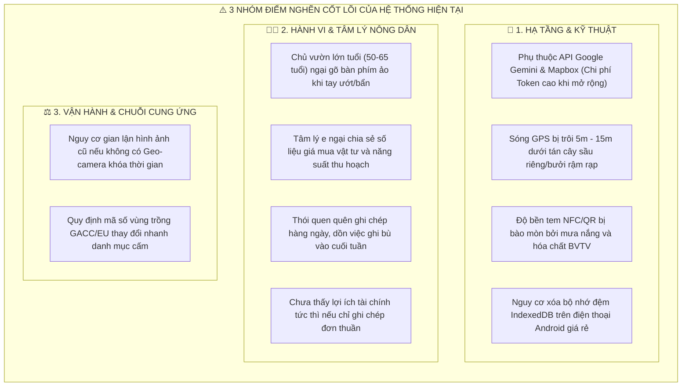
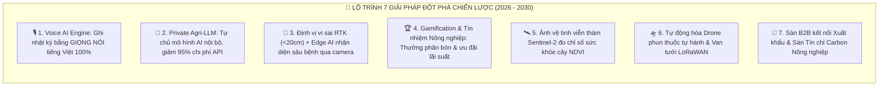

# BÁO CÁO PHÂN TÍCH CHUYÊN SÂU: BÓC TÁCH TOÀN BỘ NHƯỢC ĐIỂM HỆ THỐNG VÀ LỘ TRÌNH PHÁT TRIỂN ĐỘT PHÁ (2026 - 2030)
## TANBAO AGTECH SYSTEM BOTTLENECKS, LIMITATIONS & STRATEGIC R&D ROADMAP

```
========================================================================================================
TỔNG CÔNG TY NÔNG NGHIỆP CÔNG NGHỆ CAO TÂN BẢO (TANBAO AGTECH CORPORATION)
MÃ TÀI LIỆU: R&D-BOTTLENECK-2026 | PHIÊN BẢN: Release v1.1.2 | NĂM BAN HÀNH: 2026
ĐƠN VỊ THỰC HIỆN: VIỆN NGHIÊN CỨU & PHÁT TRIỂN CÔNG NGHỆ NÔNG NGHIỆP SỐ TÂN BẢO
========================================================================================================
```

---

# MỤC LỤC BÁO CÁO

1. **PHẦN I: BÓC TÁCH TOÀN BỘ NHƯỢC ĐIỂM, RỦI RO & ĐIỂM NGHẼN CỦA HỆ THỐNG**
   * 1.1 Nhược điểm Kỹ thuật & Hạ tầng (Technical Constraints)
   * 1.2 Nhược điểm Trải nghiệm & Tâm lý Nông dân (Adoption & Behavioral Constraints)
   * 1.3 Nhược điểm Vận hành, Kiểm toán & Chuỗi cung ứng (Operational Constraints)
2. **PHẦN II: CHIẾN LƯỢC KHẮC PHỤC & HƯỚNG PHÁT TRIỂN ĐỘT PHÁ (2026 - 2030)**
   * 2.1 Trợ lý Giọng nói Tiếng Việt 1-Chạm (Voice AI Input Engine)
   * 2.2 Tự chủ Hạ tầng AI bằng Mô hình Agri-LLM Riêng (On-Premises AI)
   * 2.3 Định vị Vi sai RTK-GPS (<20cm) & Edge Computer Vision On-Device
   * 2.4 Cơ chế Gamification & Điểm Tín nhiệm Nông nghiệp VietGAP (Agri-Credit Score)
   * 2.5 Ảnh Vệ tinh Viễn thám Đo Chỉ số Sức khỏe Cây (NDVI Index)
   * 2.6 Tự động hóa Nông trại bằng Drone Tự hành & Van tưới LoRaWAN
   * 2.7 Sàn Giao dịch Nông sản B2B & Tín chỉ Carbon Nông nghiệp (Agri-Carbon)
3. **PHẦN III: SƠ ĐỒ ĐỐI CHIẾU NHƯỢC ĐIỂM ➔ GIẢI PHÁP ĐỘT PHÁ TƯƠNG LAI**

---

# PHẦN I: BÓC TÁCH TOÀN BỘ NHƯỢC ĐIỂM & ĐIỂM NGHẼN HỆ THỐNG



### 1.1 Nhược Điểm Về Mặt Kỹ Thuật & Hạ Tầng (Technical Constraints)
1. **Phụ thuộc API Thương mại Bên thứ ba & Rủi ro Chi phí Token:**  
   Hệ thống đang sử dụng Google Gemini API và Mapbox Satellite Tiles. Ở quy mô thử nghiệm (vài trăm người), chi phí gần như bằng 0 nhờ các gói Free/Tier rẻ. Tuy nhiên, khi hệ thống đạt **100.000 - 500.000 nông hộ**, chi phí gọi API AI và tải ảnh bản đồ vệ tinh sẽ trở thành gánh nặng tài chính hàng tỷ đồng mỗi tháng nếu không tự chủ hạ tầng.
2. **Sai số Định vị GPS Dưới Tán Cây Dày (Canopy Signal Attenuation):**  
   Dưới các tán cây sầu riêng cổ thụ 10-20 năm tuổi hoặc vườn bưởi da xanh rậm rạp, sóng GPS vệ tinh dân dụng của smartphone bị tán xạ mạnh, gây sai số từ **5m - 15m**, dễ dẫn đến việc gán nhầm tọa độ giữa hai gốc cây liền kề nếu người dùng không quét chip NFC.
3. **Độ bền Vật lý Của Thẻ NFC / Tem Mã QR Ngoài Thực Địa:**  
   Khí hậu nhiệt đới gió mùa tại Việt Nam với nhiệt độ ngoài trời mùa khô lên tới 40°C, mùa mưa kéo dài kèm theo các đợt phun xịt thuốc BVTV có tính ăn mòn cao sẽ làm mờ mực in mã QR hoặc làm hỏng chip NFC thông thường sau 6 - 12 tháng.
4. **Giới hạn Bộ nhớ Trình duyệt Mobile (Storage Eviction):**  
   Trên các dòng điện thoại Android cấu hình thấp (RAM 2GB - 3GB, bộ nhớ 32GB), hệ điều hành có cơ chế tự động dọn dẹp bộ nhớ đệm trình duyệt (IndexedDB Cache Eviction) khi máy bị đầy bộ nhớ, tiềm ẩn rủi ro mất các bản ghi nhật ký offline chưa kịp đồng bộ lên máy chủ.

### 1.2 Nhược Điểm Về Mặt Trải Nghiệm & Tâm Lý Nông Dân (Adoption Constraints)
1. **Rào cản Thao tác Bàn phím & Tuổi tác:**  
   Đại bộ phận chủ vườn tại ĐBSCL và Tây Nguyên có độ tuổi từ **50 đến 65 tuổi**. Thị lực suy giảm cộng với việc bàn tay thường xuyên ướt hoặc dính bùn đất khiến việc mở điện thoại gõ từng chữ và số trên bàn phím ảo trở thành một rào cản lớn.
2. **Tâm lý E ngại Tiết lộ Bí quyết & Số liệu Nhạy cảm:**  
   Nhiều nông dân có tâm lý giữ kín công thức phối trộn phân thuốc hoặc giá bán nông sản thực tế cho thương lái vì sợ lộ bí quyết gia truyền hoặc sợ bị tính thuế, dẫn đến việc nhập số liệu đối phó hoặc không đầy đủ.
3. **Thiếu Tính Kỷ luật Trong Ghi Chép Thời Gian Thực:**  
   Nông dân thường tập trung làm việc nặng cả ngày ngoài vườn và chỉ nhớ ra việc ghi chép vào cuối tuần, làm mất đi tính "thời gian thực" của nhật ký canh tác số.

---

# PHẦN II: CHIẾN LƯỢC KHẮC PHỤC & HƯỚNG PHÁT TRIỂN ĐỘT PHÁ (2026 - 2030)



### 2.1 Trợ Lý Giọng Nói Tiếng Việt 1-Chạm (Voice AI Input Engine)
* **Mục tiêu:** Xóa bỏ 100% việc gõ phím ảo cho nông dân.
* **Cơ chế:** Tích hợp mô hình nhận diện giọng nói (Speech-to-Text) chuyên sâu về thổ ngữ nông nghiệp tiếng Việt (giọng Miền Tây, Miền Trung, Tây Nguyên).
* **Trải nghiệm thực tế:** Nông dân chỉ cần nhấn giữ biểu tượng Bé Mầm và nói:  
  *🗣️ "Bé Mầm ơi, sáng nay tưới 30 lít phân NPK 16-16-8 cho 10 cây sầu riêng hàng số 1."*  
  ➔ AI tự động bóc tách: Hoạt động = Tưới phân, Tên phân = NPK 16-16-8, Lượng = 30L, Cây = Hàng 1 ➔ Lưu nhật ký ngay lập tức!

### 2.2 Tự Chủ Hạ Tầng AI Bằng Mô Hình Agri-LLM Riêng (On-Premises AI)
* **Mục tiêu:** Cắt giảm 95% chi phí vận hành API thương mại và bảo mật dữ liệu tuyệt đối.
* **Cơ chế:** Tân Bảo AgTech sẽ fine-tune mô hình ngôn ngữ mã nguồn mở chuyên biệt về Nông học (Agri-LLM trên nền tảng Llama 3 / Gemma) được nạp toàn bộ giáo trình Học viện Nông nghiệp, phác đồ VietGAP và dược thư BVTV Việt Nam, vận hành trên cụm GPU nội bộ.

### 2.3 Định Vị Vi Sai Độ Chính Xác Cao (RTK-GPS <20cm) & Edge Computer Vision
* **Khắc phục sai số dưới tán cây:** Ứng dụng trạm phát vi sai RTK mini di động gắn trên mũ/balo của nông dân, đưa độ chính xác GPS từ sai số 10m xuống **dưới 20cm**, định vị chính xác từng gốc cây trong vườn rậm rạp.
* **Edge Computer Vision:** Mô hình AI siêu nhẹ (TensorFlow Lite / ONNX) tích hợp ngay trong app điện thoại giúp nhận diện bệnh rầy xanh, thán thư, xì mủ qua camera trong tích tắc (<0.1s) kể cả khi offline.

### 2.4 Cơ Chế Gamification & Điểm Tín Nhiệm Nông Nghiệp (Agri-Credit Score)
* **Tạo động lực tài chính cho nông dân:** Xây dựng hệ thống xếp hạng "Nông hộ Kim Cương". Nông dân ghi chép đầy đủ 100% nhật ký sẽ được tích điểm để:
  1. Đổi lấy phân bón hữu cơ vi sinh miễn phí từ các nhà tài trợ.
  2. Được cấp chứng chỉ tín nhiệm nông nghiệp để vay vốn ngân hàng đối tác với lãi suất ưu đãi giảm 1.5% - 2%/năm.

### 2.5 Ảnh Vệ Tinh Viễn Thám Đo Chỉ Số Sức Khỏe Cây (NDVI Index)
* **Giám sát diện rộng:** Tích hợp dữ liệu viễn thám từ vệ tinh Sentinel-2 (bước sóng cận hồng ngoại NIR) để đo đạc chỉ số thảm thực vật NDVI, phát hiện sớm các vùng cây bị khô hạn hoặc thiếu đạm trên diện rộng hàng ngàn hecta mà không cần đi bộ kiểm tra từng cây.

### 2.6 Tự Động Hóa Bằng Drone Phun Thuốc & Van Tưới LoRaWAN
* **Drone Tự hành:** Lập trình lộ trình bay cho Drone phun thuốc tự động chính xác vào các tọa độ cây bệnh được trích xuất từ nhật ký số của Bé Mầm.
* **Hệ thống tưới LoRaWAN:** Tự động mở van tưới nhỏ giọt khi cảm biến tầng đất báo độ ẩm tụt dưới 60% và tự ngắt khi đạt 75%.

### 2.7 Sàn Giao Dịch Nông Sản B2B & Tín Chỉ Carbon Nông Nghiệp (Agri-Carbon)
* **Thương mại hóa đầu ra:** Kết nối trực tiếp nông hộ có nhật ký số VietGAP với các doanh nghiệp thu mua xuất khẩu, đảm bảo bao tiêu đầu ra với giá cao hơn 15% - 20% so với thương lái tự do.
* **Tín chỉ Carbon:** Đo lường lượng khí thải nhà kính (CH4, N2O) giảm được nhờ tối ưu phân bón để quy đổi thành Tín chỉ Carbon quốc tế, tạo thêm dòng tiền hàng triệu USD cho cộng đồng nông hộ liên kết.

---

# PHẦN III: BẢNG ĐỐI CHIẾU: NHƯỢC ĐIỂM ➔ GIẢI PHÁP ĐỘT PHÁ

| Nhóm Vấn Đề | Nhược Điểm / Rủi Ro Hiện Tại | Giải Pháp Đột Phá (Giai đoạn 2026 - 2030) |
| :--- | :--- | :--- |
| **Giao tiếp Nông dân** | Nông dân lớn tuổi ngại gõ phím cảm ứng | **Voice AI Engine:** Ghi nhật ký bằng giọng nói tiếng Việt 100% |
| **Chi phí Vận hành** | Phụ thuộc chi phí Token API Google Gemini | **Private Agri-LLM:** Tự chủ mô hình AI chạy trên server GPU riêng |
| **Độ chính xác GPS** | Sóng GPS bị sai số 5-15m dưới tán cây dày | **RTK-GPS Vi Sai:** Định vị chính xác từng gốc cây <20cm |
| **Độ bền Thẻ Cây** | Tem QR / Chip NFC bị hỏng do nắng mưa | **Tem Composite Chuyên Dụng:** Chống tia UV và chịu hóa chất 5 năm |
| **Động lực Nông hộ** | Nông dân quên ghi chép, thiếu động lực | **Gamification & Agri-Credit:** Tích điểm đổi phân bón & giảm lãi suất vay |
| **Chẩn đoán Bệnh** | Phải có mạng mới gửi ảnh lên AI phân tích | **Edge Computer Vision:** Nhận diện sâu bệnh trên camera offline <0.1s |
| **Thương mại Hóa** | Nông dân vẫn bị thương lái ép giá | **Sàn B2B & Agri-Carbon:** Bao tiêu xuất khẩu giá cao + Bán tín chỉ Carbon |

---

> **KẾT LUẬN & CAM KẾT HÀNH ĐỘNG:**  
> Việc nhìn nhận thẳng thắn các nhược điểm không làm giảm giá trị của hệ thống, mà chính là nền tảng để **Tân Bảo AgTech Corporation** xây dựng lộ trình R&D vững chắc, biến thách thức thành lợi thế cạnh tranh độc quyền, đưa nông nghiệp Việt Nam trở thành hình mẫu chuyển đổi số tiêu biểu trên trường quốc tế!
