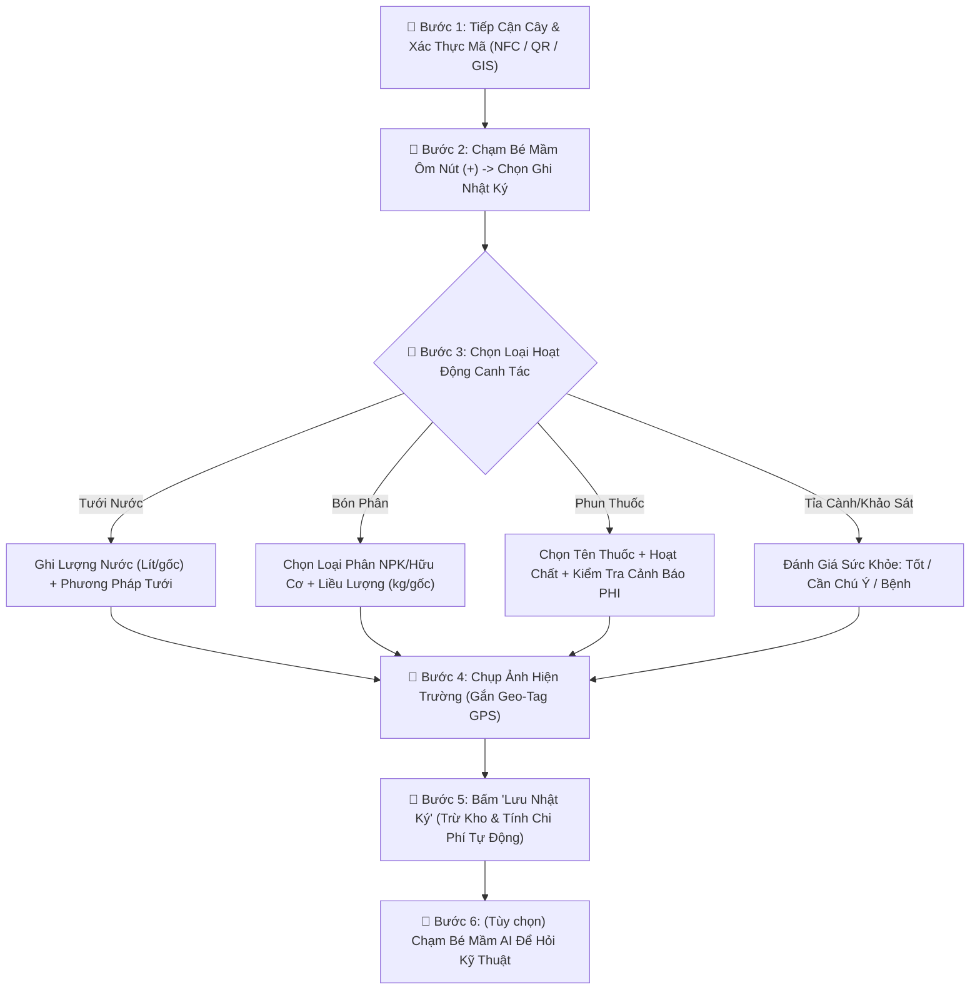
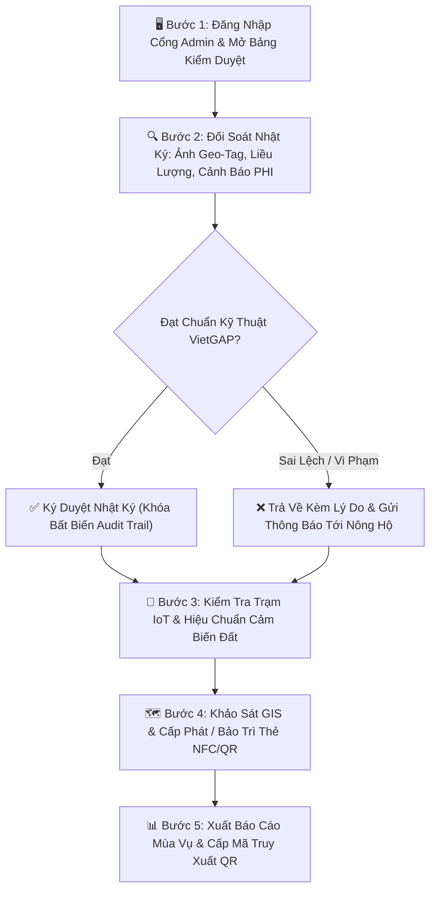
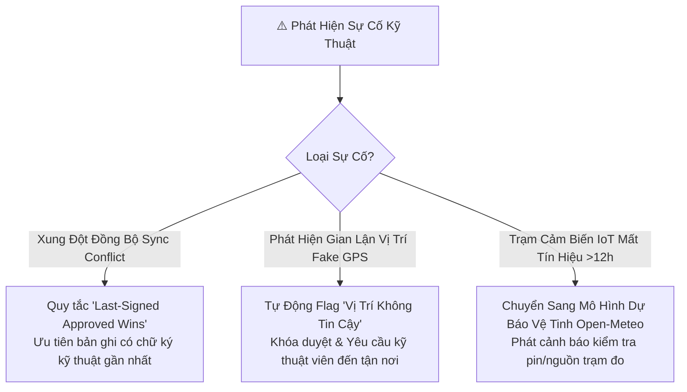

# BỘ TÀI LIỆU QUY TRÌNH VẬN HÀNH TIÊU CHUẨN (STANDARD OPERATING PROCEDURES - SOP)
## HỆ THỐNG SỔ TAY NHẬT KÝ ĐIỆN TỬ CHO CÂY TRỒNG (TANBAO AGTECH v1.1.1)

```
========================================================================================
CÔNG TY CỔ PHẦN NÔNG NGHIỆP CÔNG NGHỆ CAO TÂN BẢO (TANBAO AGTECH CORP)
MÃ TÀI LIỆU: SOP-TB-AGTECH-2026 | PHIÊN BẢN: v1.1.1 | NGÀY BAN HÀNH: 25/08/2026
TIÊU CHUẨN ÁP DỤNG: ISO 9001:2015, VIETGAP / GLOBALGAP, ISO/IEC 11558
========================================================================================
```

> **TỔNG QUAN HỆ THỐNG QUY TRÌNH:**  
> Bộ tài liệu này được biên soạn theo chuẩn **ISO 9001:2015** và nguyên tắc thực hành nông nghiệp tốt **VietGAP / GlobalGAP**, được phân chia làm 2 quy trình độc lập phục vụ 2 nhóm tác nhân chính tại hiện trường vườn cây:
> 1. **SOP 01 (Mã: `SOP-FARM-01`):** Dành cho **Người Nông Dân / Nông Hộ** — Quy trình ghi nhận nhật ký canh tác thực địa 1-chạm, kiểm soát phân thuốc/PHI, quét OCR vật tư và tra cứu trợ lý AI Bé Mầm.
> 2. **SOP 02 (Mã: `SOP-TECH-02`):** Dành cho **Kỹ Thuật Viên / Cán Bộ Vận Hành & Bảo Trì** — Quy trình kiểm duyệt dữ liệu, quản trị định vị GIS, hiệu chuẩn cảm biến IoT, xử lý xung đột đồng bộ và cấp phát thẻ NFC/QR.

---

```
========================================================================================================
                                                PHẦN 1
                     QUY TRÌNH DÀNH CHO NGƯỜI NÔNG DÂN / CHỦ TRANG TRẠI
========================================================================================================
```

# QUY TRÌNH VẬN HÀNH CHUẨN: GHI NHẬT KÝ CANH TÁC THỰC ĐỊA & TRA CỨU TRỢ LÝ AI

### 1. THÔNG TIN QUY TRÌNH (METADATA)
* **Mã quy trình (SOP Code):** `SOP-FARM-01`
* **Tên quy trình:** Quy trình Ghi nhật ký Canh tác Thực địa, Quản lý Tiêu hao Vật tư và Khai thác Trợ lý AI Bé Mầm.
* **Phiên bản & Ngày hiệu lực:** `v1.1.1` | Có hiệu lực từ ngày: **25/08/2026**
* **Phạm vi áp dụng:** Áp dụng cho toàn bộ Nông dân, Chủ trang trại, Công nhân phụ trách vườn cây sử dụng Cổng Nông Hộ (PWA Mobile/Web App) tại thực địa vườn cây.

---

### 2. MỤC ĐÍCH & ĐIỀU KIỆN TIÊN QUYẾT
* **Mục đích:**
  * Số hóa 100% các hoạt động canh tác (tưới tiêu, bón phân NPK, phun thuốc BVTV, cắt tỉa cành, thu hoạch) ngay tại gốc cây trong thời gian thực.
  * Tự động kiểm soát thời gian cách ly thuốc BVTV (PHI) để đảm bảo nông sản sạch chuẩn VietGAP.
  * Tự động hóa việc hạch toán chi phí vật tư và nhận tư vấn kỹ thuật trực tiếp từ AI Bé Mầm.
* **Điều kiện tiên quyết (Pre-conditions):**
  * **Thiết bị & Quyền ứng dụng:** Điện thoại thông minh (Android/iOS) đã cài đặt PWA Sổ Nông Tân Bảo; Bật quyền **Vị trí (GPS)**, **Máy ảnh (Camera)** và **Bộ nhớ đệm (Storage)**.
  * **Tài khoản:** Đã đăng nhập tài khoản Nông hộ (Role: `user`), được gán ít nhất một trang trại đang hoạt động.
  * **Thực địa:** Cây trồng đã được gán mã định danh (VD: `SR-001`) hoặc gắn tem QR/chip NFC trên thân cây.

---

### 3. MA TRẬN TRÁCH NHIỆM (RACI MATRIX)
| Vai trò / Vị trí | Trách nhiệm trong quy trình `SOP-FARM-01` |
| :--- | :--- |
| **Nông dân / Người làm vườn (Field User)** | **R (Responsible):** Trực tiếp thực hiện công việc ngoài vườn và ghi nhật ký 1-chạm lên ứng dụng ngay sau khi hoàn thành. |
| **Kỹ thuật viên / Kỹ sư hiện trường (Supervisor)** | **A (Accountable):** Kiểm tra tính hợp lệ của nhật ký, đối soát ảnh chụp hiện trường và ký duyệt dữ liệu. |
| **Trợ lý AI Bé Mầm (AI Copilot Engine)** | **C (Consulted):** Tự động phân tích sâu bệnh, kiểm tra thời gian cách ly PHI và hướng dẫn kỹ thuật canh tác. |
| **Ban Quản trị HTX / Đơn vị thu mua (Auditor)** | **I (Informed):** Nhận báo cáo tổng hợp mùa vụ và dữ liệu truy xuất nguồn gốc phục vụ tiêu thụ. |

---

### 4. QUY TRÌNH THỰC HIỆN CHI TIẾT (STEP-BY-STEP)



#### Bước 1: Tiếp cận cây trồng & Xác thực mã định danh
* **Thao tác trên ứng dụng:**
  * Di chuyển đến gốc cây cần chăm sóc.
  * Bật ứng dụng, đưa mặt lưng điện thoại chạm vào **Thẻ NFC** trên thân cây HOẶC chọn biểu tượng **Quét mã QR** để quét tem cây.
  * *Trường hợp không dùng tem:* Mở tab **"Trang chủ"** / **"Cây trồng"**, chạm vào vị trí cây trên bản đồ vệ tinh GIS.
* **Hệ thống xử lý:** Tự động mở đúng hồ sơ cây trồng (Mã cây: `SR-001`, giống: *Sầu riêng Ri6*, tuổi cây, lịch sử chăm sóc trước đó).
* **Kết quả đầu ra:** Ứng dụng hiển thị màn hình thông tin chi tiết cây trồng.

#### Bước 2: Kích hoạt màn hình ghi nhận qua "Bé Mầm Ôm Nút Dấu Cộng (+)"
* **Thao tác trên ứng dụng:** Chạm vào biểu tượng **Bé Mầm Ôm Nút Dấu Cộng (+)** ở góc dưới bên phải màn hình ➔ Menu 2 lựa chọn mở ra ➔ Nhấn chọn mục **"📝 Ghi nhật ký chăm sóc"**.
* **Hệ thống xử lý:** Mở cửa sổ Modal ghi chép (Care Modal) với tọa độ GPS hiện tại được ghim tự động.
* **Kết quả đầu ra:** Form nhập liệu sẵn sàng cho thao tác.

#### Bước 3: Nhập thông số hoạt động canh tác chuẩn xác
* **A. Đối với hoạt động Tưới Nước:**
  * Chọn phương pháp: *Tưới nhỏ giọt / Tưới phun mưa / Tưới gốc*.
  * Nhập lượng nước: *VD: 30 Lít/gốc*.
  * Kiểm tra độ ẩm đất khuyến nghị: Duy trì từ **65% - 75%**.
* **B. Đối với hoạt động Bón Phân:**
  * Chọn danh mục phân bón: *NPK 16-16-8 / NPK 30-10-10 / Phân trùn quế / Phân hữu cơ vi sinh*.
  * Nhập liều lượng: *VD: 0.5 kg/gốc*.
  * Phương pháp bón: *Rải quanh tán rễ / Hòa nước tưới nhỏ giọt*.
* **C. Đối với hoạt động Phun Thuốc BVTV (BẮT BUỘC KIỂM SOÁT PHI):**
  * Chọn loại thuốc BVTV và hoạt chất: *VD: Ridomil Gold (Metalaxyl + Mancozeb)*.
  * Nhập nồng độ pha chế: *VD: 50g / bình 20 Lít*.
  * Đối tượng phòng trừ: *Bệnh vàng lá thối rễ / Xì mủ / Rầy xanh*.
  * **KIỂM TRA CẢNH BÁO PHI:** Hệ thống tự động tính ngày cách ly an toàn. Nếu gần ngày thu hoạch dự kiến (< 7-14 ngày), màn hình sẽ bật **Cảnh báo Đỏ vi phạm VietGAP**.
* **D. Đối với hoạt động Cắt Tỉa Cành & Kiểm Tra Sức Khỏe:**
  * Cập nhật trạng thái cây: *Khỏe mạnh / Cần chú ý / Bị bệnh / Nguy cấp*.
  * Nhập mô tả triệu chứng (nếu có): *VD: Xuất hiện đốm mắt cua trên lá non tầng giữa*.

#### Bước 4: Chụp ảnh hiện trường có đính kèm tọa độ thực địa
* **Thao tác trên ứng dụng:** Nhấn nút **"📷 Chụp ảnh hiện trường"** ➔ Chụp cận cảnh tán lá, gốc cây hoặc bao bì phân thuốc vừa sử dụng.
* **Hệ thống xử lý:** Tự động đóng dấu Watermark không thể chỉnh sửa gồm: **Tọa độ GPS (Lat/Long)** + **Dấu thời gian (Timestamp)** + **Mã định danh cây**.
* **Kết quả đầu ra:** Ảnh hiện trường được nén tối ưu (dung lượng < 300KB) và gắn kèm bản ghi.

#### Bước 5: Xác nhận & Lưu nhật ký số
* **Thao tác trên ứng dụng:** Kiểm tra lại các thông số ➔ Bấm nút **"Lưu nhật ký"**.
* **Hệ thống xử lý:**
  1. Ghi nhận dữ liệu vào bảng `plant_logs`.
  2. Tự động tính toán chi phí (Số lượng x Đơn giá) và khấu trừ số lượng tương ứng trong bảng Kho vật tư `supplies`.
  3. Đẩy thông báo đồng bộ thời gian thực qua WebSocket lên bảng điều khiển của Kỹ thuật viên.
* **Kết quả đầu ra:** Bản ghi chuyển sang trạng thái **"Đã lưu thành công" (Status: `Submitted`)**.

#### Bước 6: Nhập kho vật tư nhanh bằng Camera AI OCR (Khi mua phân thuốc mới)
* **Thao tác trên ứng dụng:** Vào menu **"Vật tư"** ➔ Nhấn **"+ Thêm vật tư mới"** ➔ Chọn **"Quét bao bì / Hóa đơn (AI OCR)"** ➔ Chụp ảnh bao bì thuốc.
* **Hệ thống xử lý:** Trí tuệ nhân tạo Gemini Vision tự động đọc chữ trên nhãn, bóc tách chính xác: Tên sản phẩm, Đơn vị tính, Hoạt chất chính, Đơn giá mua ➔ Tự động điền vào form.
* **Kết quả đầu ra:** Nông hộ chỉ cần bấm **"Lưu kho"**, không cần gõ chữ thủ công.

---

### 5. XỬ LÝ SỰ CỐ & NGOẠI LỆ THỰC ĐỊA (FIELD EDGE CASES)

| Tình huống ngoại lệ | Nguyên nhân thực tế | Kịch bản xử lý bắt buộc cho Nông dân |
| :--- | :--- | :--- |
| **Mất sóng 3G/4G ngoài vườn cây** | Vườn ở vùng sâu, đồi dốc mất kết nối viễn thông. | **Cơ chế Offline PWA:** Cứ thao tác và bấm "Lưu nhật ký" bình thường. Dữ liệu và hình ảnh sẽ được lưu trữ an toàn trong bộ nhớ đệm (IndexedDB). Khi nông dân về đến nhà có Wifi, ứng dụng **tự động chạy ngầm đồng bộ 100% dữ liệu** lên máy chủ. |
| **Tem QR bị mờ / Chip NFC bị hỏng** | Do mưa nắng, phân thuốc bám dính ngoài trời. | Nhập thủ công mã cây (VD: `SR-001`) vào ô tìm kiếm hoặc mở tab **Bản đồ GIS** chạm trực tiếp vào icon cây trên màn hình. Báo kỹ thuật viên cấp lại tem mới trong ca trực. |
| **Cảnh báo thời gian cách ly PHI màu đỏ** | Nông dân chọn phun thuốc hóa học quá sát ngày thu hoạch. | **DỪNG PHUN NGAY LẬP TỨC.** Bấm vào Bé Mầm AI để hỏi hoạt chất sinh học thay thế an toàn không vi phạm thời gian cách ly xuất khẩu. |

---

### 6. BẢNG CHECKLIST KIỂM TRA CHO NÔNG DÂN (FARMER CHECKLIST)
Trước khi kết thúc buổi làm việc ngoài vườn, người nông dân tích chọn kiểm tra:
* [ ] Đã quét đúng mã cây hoặc chọn đúng vị trí cây trên bản đồ GIS.
* [ ] Đã ghi rõ liều lượng phân bón (kg) hoặc lượng nước tưới (lít).
* [ ] Đã chụp ảnh hiện trường rõ nét thể hiện tình trạng cây hoặc bao bì thuốc.
* [ ] Đã kiểm tra không vi phạm cảnh báo thời gian cách ly thuốc BVTV (PHI).
* [ ] Đã bấm "Lưu nhật ký" và màn hình hiển thị thông báo lưu thành công.
* [ ] (Nếu làm việc offline) Đã kết nối lại Wifi cuối ngày để đồng bộ dữ liệu.

---
---

```
========================================================================================================
                                                PHẦN 2
               QUY TRÌNH DÀNH CHO KỸ THUẬT VIÊN VẬN HÀNH & BẢO TRÌ HỆ THỐNG
========================================================================================================
```

# QUY TRÌNH VẬN HÀNH CHUẨN: KIỂM DUYỆT NHẬT KÝ, GIÁM SÁT IoT/GIS & BẢO TRÌ HẠ TẦNG SỐ THỰC ĐỊA

### 1. THÔNG TIN QUY TRÌNH (METADATA)
* **Mã quy trình (SOP Code):** `SOP-TECH-02`
* **Tên quy trình:** Quy trình Kiểm duyệt Dữ liệu Canh tác, Quản trị Bản đồ GIS, Hiệu chuẩn Trạm IoT và Bảo trì Hạ tầng Số Thực địa.
* **Phiên bản & Ngày hiệu lực:** `v1.1.1` | Có hiệu lực từ ngày: **25/08/2026**
* **Phạm vi áp dụng:** Áp dụng cho Kỹ sư Nông nghiệp, Kỹ thuật viên hiện trường, Chuyên viên IT vận hành hệ thống sử dụng Cổng Quản Trị (Admin Command Center).

---

### 2. MỤC ĐÍCH & ĐIỀU KIỆN TIÊN QUYẾT
* **Mục đích:**
  * Giám sát, kiểm tra chéo và phê duyệt toàn bộ nhật ký canh tác của các nông hộ theo chuẩn VietGAP.
  * Quản trị ranh giới bản đồ GIS vệ tinh Mapbox, đảm bảo tọa độ số của từng cây trồng chuẩn xác.
  * Hiệu chuẩn trạm cảm biến IoT và thiết lập bộ quy tắc cảnh báo dịch bệnh tự động (Rule Engine).
  * Xử lý xung đột đồng bộ dữ liệu và bảo trì định kỳ hạ tầng tem thẻ NFC/QR ngoài vườn.
* **Điều kiện tiên quyết (Pre-conditions):**
  * Tài khoản được cấp quyền Quản trị / Kỹ thuật viên (Role: `admin` hoặc `supervisor`).
  * Thiết bị làm việc: Máy tính bảng chuyên dụng hiện trường hoặc Laptop/PC có kết nối mạng.
  * Có quyền truy cập vào Hệ thống Cơ sở dữ liệu PostgreSQL và Bảng điều khiển Quản trị.

---

### 3. MA TRẬN TRÁCH NHIỆM (RACI MATRIX)
| Vai trò / Vị trí | Trách nhiệm trong quy trình `SOP-TECH-02` |
| :--- | :--- |
| **Kỹ thuật viên hiện trường (Field Tech)** | **R (Responsible):** Trực tiếp kiểm duyệt nhật ký, hiệu chuẩn cảm biến IoT, dán tem QR/NFC và xử lý lỗi thiết bị. |
| **Kỹ sư trưởng / Trưởng phòng Kỹ thuật (Lead Agronomist)** | **A (Accountable):** Chịu trách nhiệm pháp lý cao nhất về việc phê duyệt chứng nhận VietGAP và thẩm định phác đồ điều trị sâu bệnh. |
| **Chuyên viên Quản trị Hệ thống / IT (System Admin)** | **C (Consulted):** Hỗ trợ cấu hình CSDL, phân quyền tài khoản và xử lý lỗi phần mềm/mạng. |
| **Ban Giám Đốc Doanh nghiệp / HTX (Management)** | **I (Informed):** Nhận báo cáo chất lượng canh tác, tình trạng dịch hại và kiểm toán chi phí định kỳ. |

---

### 4. QUY TRÌNH THỰC HIỆN CHI TIẾT (STEP-BY-STEP)



#### Bước 1: Đăng nhập Cổng Quản trị & Truy cập Trung tâm Điều hành
* **Thao tác trên ứng dụng:**
  * Truy cập cổng Quản trị `/admin` ➔ Đăng nhập bằng tài khoản Kỹ thuật viên được cấp.
  * Mở mục **"Nhật ký canh tác"** (hoặc **"Lịch sử chăm sóc"**).
* **Hệ thống xử lý:** Hệ thống hiển thị toàn bộ danh sách bản ghi mới gửi từ tất cả các nông hộ theo thời gian thực (qua WebSocket).
* **Kết quả đầu ra:** Danh sách các bản ghi chờ duyệt (Status: `Pending Review`).

#### Bước 2: Đối soát dữ liệu kỹ thuật và thẩm định hình ảnh Geo-tag
* **Thao tác trên ứng dụng:** Kỹ thuật viên click vào từng bản ghi để kiểm tra 4 thông số cốt lõi:
  1. **Hình ảnh hiện trường:** Kiểm tra ảnh chụp có chứa đúng Watermark tọa độ vườn cây và thời gian thực tế hay không.
  2. **Liều lượng phân bón:** Đối chiếu lượng NPK có vượt ngưỡng cho phép theo giai đoạn sinh trưởng hay không.
  3. **Thời gian cách ly PHI:** Kiểm tra hoạt chất thuốc BVTV đã qua thời gian cách ly an toàn trước ngày thu hoạch hay chưa.
  4. **Số lượng tiêu hao vật tư:** Xác minh số lượng xuất kho thực tế khớp với diện tích vườn.
* **Hệ thống xử lý:** Tự động highlight màu vàng các trường nghi vấn và màu đỏ các trường vi phạm quy chuẩn VietGAP.

#### Bước 3: Ra quyết định Phê duyệt (Approval) hoặc Yêu cầu hiệu chỉnh
* **Trường hợp ĐẠT:** Nhấn nút **"✅ Phê duyệt nhật ký"** ➔ Bản ghi được khóa bất biến (Immutability), mã hóa lưu vết kiểm toán (Audit Trail) và đưa vào hồ sơ chứng nhận VietGAP.
* **Trường hợp KHÔNG ĐẠT:** Nhấn nút **"❌ Từ chối / Yêu cầu chỉnh sửa"** ➔ Nhập rõ lý do (VD: *Liều lượng phân bón NPK vượt 20% khuyến cáo giai đoạn làm bông*) ➔ Hệ thống tự động gửi thông báo đẩy (Notification) đến điện thoại của Nông hộ để kiểm tra lại vườn.

#### Bước 4: Kiểm tra trạm quan trắc IoT & Hiệu chuẩn cảm biến thực địa
* **Thao tác thực địa & ứng dụng:**
  * Định kỳ 15 ngày/lần, kỹ thuật viên mang thiết bị đo chuẩn (Master Soil Tester) đến vườn cây.
  * Mở mục **"Cảm biến IoT"** trên Cổng Admin ➔ Đọc chỉ số độ ẩm đất, pH đất và nhiệt độ không khí từ trạm IoT gửi về.
  * Cắm máy đo chuẩn đối chứng. Nếu sai lệch > 5%: Mở tính năng **"Hiệu chuẩn cảm biến (Calibrate)"** trên ứng dụng để bù trừ sai số số học.
* **Kết quả đầu ra:** Dữ liệu cảm biến IoT đạt độ chính xác > 98%.

#### Bước 5: Cấp phát mới & Bảo trì tem thẻ NFC/QR cây trồng
* **Thao tác thực địa:**
  * Khi trang trại có cây mới trồng hoặc tem cũ bị hỏng: Kỹ thuật viên mang theo tem QR chống nước hoặc thẻ chip NFC mới.
  * Mở tab **"Cây trồng"** trên ứng dụng ➔ Chọn mã cây tương ứng (VD: `SR-088`) ➔ Nhấn **"Gán thẻ NFC/QR mới"**.
  * Chạm thẻ NFC vào lưng điện thoại hoặc quét mã QR mới ➔ Nhấn **"Xác nhận liên kết"**.
* **Hệ thống xử lý:** Cập nhật trường `nfc_tag_id` và `qr_code` mới vào CSDL, vô hiệu hóa mã thẻ cũ bị mất.

#### Bước 6: Kiểm toán chi phí & Xuất hồ sơ truy xuất nguồn gốc nông sản
* **Thao tác trên ứng dụng:** Vào mục **"Báo cáo mùa vụ"** ➔ Chọn khoảng thời gian thu hoạch và trang trại cần cấp mã ➔ Nhấn **"Xuất báo cáo VietGAP & Mã QR Truy xuất"**.
* **Hệ thống xử lý:** Tự động tổng hợp toàn bộ lịch sử tưới tiêu, danh mục phân thuốc đã dùng, chứng minh 100% tuân thủ PHI và tính toán tổng chi phí đầu tư.
* **Kết quả đầu ra:** File báo cáo PDF chuẩn hóa kèm Mã QR công khai để dán lên thùng nông sản xuất khẩu.

---

### 5. XỬ LÝ SỰ CỐ & NGOẠI LỆ KỸ THUẬT (TECHNICAL EXCEPTION HANDLING)



1. **Xung đột phiên bản khi đồng bộ (Sync Conflict Resolution):**
   * *Nguyên nhân:* Nông dân ghi offline trên 2 thiết bị khác nhau cho cùng một cây.
   * *Quy tắc xử lý:* Hệ thống áp dụng quy tắc **"Last Approved Write Wins"** kết hợp Timestamp. Nếu có sự chênh lệch lớn về dữ liệu vật tư, kỹ thuật viên mở giao diện đối soát 2 phiên bản và quyết định giữ phiên bản có ảnh Geo-tag chuẩn xác hơn.
2. **Phát hiện gian lận vị trí (Fake GPS / Mock Location):**
   * *Cơ chế:* Hệ thống tự động phân tích độ chính xác GPS (`accuracy > 50m`), tốc độ di chuyển bất thường (> 100km/h giữa 2 lần check-in liên tiếp), hoặc cờ can thiệp phần mềm Mock Location.
   * *Xử lý:* Tự động gắn cờ **"Cảnh báo vị trí không tin cậy"** và chặn duyệt từ xa; Kỹ thuật viên phải đến trực tiếp vườn để quét NFC vật lý xác thực.
3. **Trạm IoT mất kết nối (Offline Sensor Telemetry > 12 giờ):**
   * *Xử lý:* Hệ thống tự động kích hoạt chế độ **"Virtual Weather Mode"** — lấy dữ liệu vi khí hậu từ trạm vệ tinh Open-Meteo để bù đắp, đồng thời gửi thông báo sự cố tới Kỹ thuật viên để kiểm tra nguồn điện năng lượng mặt trời hoặc pin trạm đo.

---

### 6. BẢNG CHECKLIST KIỂM SOÁT DÀNH CHO KỸ THUẬT VIÊN (SUPERVISOR CHECKLIST)
Kỹ thuật viên hoàn thành kiểm tra và ký nhận ca trực hàng ngày:
* [ ] 100% nhật ký canh tác trong ngày của các trang trại phụ trách đã được đối soát ảnh Geo-tag và xử lý (Duyệt / Trả về).
* [ ] Đã kiểm tra không có bất kỳ lô cây nào vi phạm thời gian cách ly thuốc BVTV (PHI).
* [ ] Các trạm cảm biến IoT đất và khí tượng đều đang online và sai số trong ngưỡng cho phép (< 5%).
* [ ] Toàn bộ cây trồng mới bổ sung trong ngày đã được gắn mã định danh và ghim tọa độ GIS chuẩn xác.
* [ ] Đã kiểm tra số lượng tồn kho vật tư thực tế khớp với số liệu trừ tự động trên phần mềm.
* [ ] Không còn bản ghi nào bị treo cờ cảnh báo gian lận vị trí hoặc lỗi xung đột dữ liệu chưa được xử lý.

---

> **PHÊ DUYỆT & BAN HÀNH:**  
> Tài liệu quy trình SOP này được ban hành chính thức và có giá trị áp dụng bắt buộc trên toàn bộ hệ thống nông trại thuộc **Công ty Cổ phần Nông nghiệp Công nghệ cao Tân Bảo**. Mọi sửa đổi phải được thông qua Hội đồng Kỹ thuật và lưu vết phiên bản theo chuẩn ISO 9001:2015.
