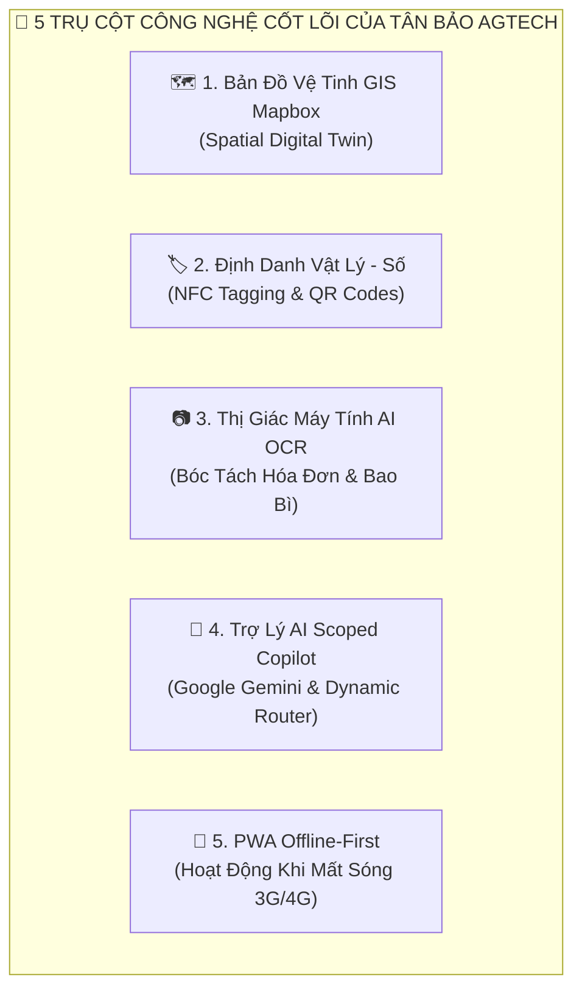
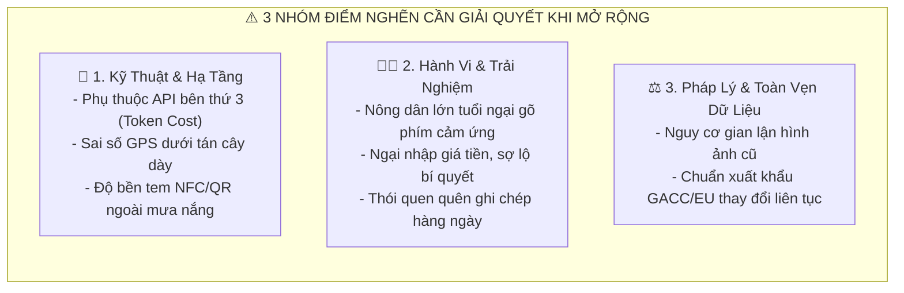
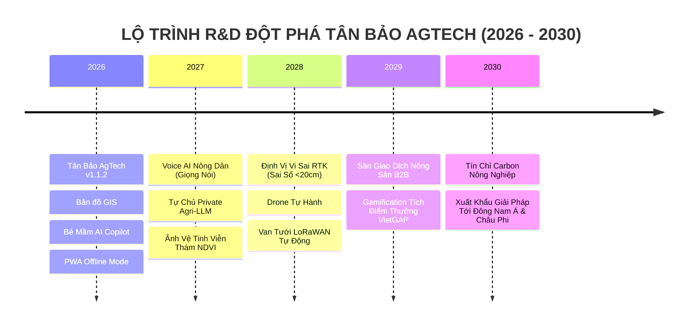

# SÁCH KỸ THUẬT & NGHIÊN CỨU PHÁT TRIỂN SẢN PHẨM (R&D WHITEPAPER)
## KỶ NGUYÊN SỐ HÓA NÔNG NGHIỆP: HỆ THỐNG SỔ NÔNG ĐIỆN TỬ, BẢN ĐỒ GIS & TRỢ LÝ AI AGTECH
*(THE DIGITAL AGTECH COMPENDIUM: ARCHITECTURE, OPERATION, LIMITATIONS & FUTURE R&D ROADMAP)*

```
========================================================================================================
TỔNG CÔNG TY NÔNG NGHIỆP CÔNG NGHỆ CAO TÂN BẢO (TANBAO AGTECH CORPORATION)
MÃ XUẤT BẢN: ISBN-AGTECH-2026-TB | PHIÊN BẢN HỆ THỐNG: Release v1.1.2 | NĂM XUẤT BẢN: 2026
ĐƠN VỊ CHỦ QUẢN: VIỆN NGHIÊN CỨU VÀ PHÁT TRIỂN CÔNG NGHỆ NÔNG NGHIỆP SỐ TÂN BẢO
========================================================================================================
```

---

# LỜI TỰA: CHUYỂN ĐỔI SỐ NÔNG NGHIỆP — TỪ KHÁT VỌNG ĐẾN THỰC THI

Nền nông nghiệp Việt Nam đang bước vào giai đoạn chuyển mình mang tính lịch sử: Chuyển dịch mạnh mẽ từ phương thức canh tác truyền thống dựa trên kinh nghiệm cảm tính sang nền **Nông nghiệp Chính xác (Precision Agriculture)** dựa trên dữ liệu thời gian thực và trí tuệ nhân tạo. 

Cuốn sách này là công trình nghiên cứu và đúc kết toàn diện từ hàng ngàn giờ thử nghiệm thực địa tại các vùng chuyên canh cây ăn trái giá trị cao (Sầu riêng, Bưởi da xanh, Bơ, Mít) tại Đồng bằng sông Cửu Long và Tây Nguyên. Chúng tôi xây dựng cuốn sách này như một bản kim chỉ nam kỹ thuật, cẩm nang vận hành, bản phân tích khách quan các điểm nghẽn kỹ thuật và lộ trình nghiên cứu phát triển (R&D) dành cho các kỹ sư công nghệ, nhà quản trị hợp tác xã, chuyên gia nông học và toàn thể bà con nông dân.

---

# CHƯƠNG 1: Ý NGHĨA KINH TẾ - XÃ HỘI VÀ TẦM NHÌN SẢN PHẨM

### 1.1 Giải Quyết 4 Nỗi Đau Lớn Của Ngành Nông Nghiệp Truyền Thống
1. **Đứt Gãy Dữ Liệu Thực Địa & Rủi Ro Gian Lận:** Việc ghi chép bằng sổ giấy truyền thống dẫn đến hơn 80% dữ liệu bị thất lạc hoặc ghi bù sai lệch, không đáp ứng được yêu cầu thanh tra nghiêm ngặt của các thị trường xuất khẩu cao cấp (EU, Mỹ, Nhật Bản, Trung Quốc).
2. **Lãng Phí Chi Phí & Thoái Hóa Đất:** Thói quen bón phân, phun thuốc theo cảm tính gây lãng phí 20% - 35% chi phí vật tư hàng năm và làm suy thoái hệ vi sinh vật đất.
3. **Sự Thiếu Hụt Chuyên Gia Nông Nghiệp Hiện Trường:** Tỷ lệ kỹ sư nông nghiệp trên số lượng nông hộ quá thấp khiến việc chẩn đoán dịch bệnh bị chậm trễ từ 3-5 ngày, gây thiệt hại nghiêm trọng khi dịch hại bùng phát.
4. **Khó Khăn Trong Quản Trị Chuỗi Cung Ứng & Hợp Tác Xã:** Ban quản trị HTX và Doanh nghiệp chế biến không thể nắm bắt được tiến độ mùa vụ, sản lượng dự kiến và chi phí đầu tư của từng hộ liên kết.

### 1.2 Giá Trị Kinh Tế Đo Lường Được (Measurable ROI)
* **Tiết kiệm 20% - 30% chi phí phân bón & thuốc BVTV:** Nhờ công nghệ bóc tách hóa đơn OCR, đối soát định mức và khuyến cáo chuẩn VietGAP.
* **Gia tăng 15% - 25% giá trị nông sản:** Nhờ tem mã QR truy xuất nguồn gốc số học gắn liền với lý lịch từng gốc cây.
* **Tiết kiệm 90% thời gian tổng hợp báo cáo:** Hệ thống tự động trích xuất báo cáo tài chính và hồ sơ kiểm toán mùa vụ chỉ sau 1 cú nhấp chuột.

---

# CHƯƠNG 2: NỀN TẢNG CÔNG NGHỆ ĐỘT PHÁ CỦA HỆ THỐNG



1. **Bản đồ Số Không Gian GIS Mapbox (Spatial Digital Twin):** Số hóa từng thửa đất bằng ranh giới Polygon, gắn tọa độ GPS của từng gốc cây lên ảnh vệ tinh độ phân giải cao, kết nối trực tiếp với trạm dự báo thời tiết 6 ngày.
2. **Định danh Vật lý - Số hóa (Phygital NFC & QR Codes):** Gắn chip NFC và tem mã QR chống nước ngoài trời lên thân cây, biến mỗi gốc cây thành một thực thể số có lý lịch sinh trưởng riêng biệt.
3. **Thị giác Máy tính AI OCR (Vision AI Parser):** Sử dụng trí tuệ nhân tạo để đọc chữ trên bao bì thuốc và hóa đơn mua hàng, tự động trích xuất hoạt chất, quy cách đóng gói và đơn giá.
4. **Trợ lý AI Bé Mầm & Điều hướng Mô hình Động:** Phân luồng câu hỏi thông minh, ưu tiên model tiết kiệm quota cho câu hỏi thường và triệu hồi model Flagship cho câu hỏi khó; bảo mật tuyệt đối dữ liệu theo từng tài khoản nông hộ.
5. **Kiến trúc PWA Offline-First:** Bộ nhớ đệm IndexedDB cho phép ghi chép ngoài vườn cây khi mất mạng và tự động đồng bộ nền khi có Wifi.

---

# CHƯƠNG 3: CẨM NANG VẬN HÀNH & HƯỚNG DẪN SỬ DỤNG TOÀN DIỆN

### 3.1 Quy Trình 4 Bước Bắt Đầu Dành Cho Nông Hộ (Farmer Manual)
* **Bước 1: Khởi tạo Trang Trại Mới:** Vào menu **"Trang trại"** ➔ Bấm **"+ Khởi tạo Trang trại mới (GPS)"** ➔ Điền tên vườn, diện tích và bấm **"Lấy GPS"** để hệ thống tự động ghim vị trí vệ tinh và kết nối trạm thời tiết 6 ngày.
* **Bước 2: Thêm Cây Trồng & Gán Mã:** Vào trang trại ➔ Bấm **"+ Thêm cây"** ➔ Nhập mã cây (VD: `SR-001`), chọn giống cây và định vị trên bản đồ GIS hoặc quét thẻ NFC/QR.
* **Bước 3: Ghi Nhật Ký 1-Chạm Qua Bé Mầm:** Chạm vào biểu tượng **Bé Mầm Ôm Nút Dấu Cộng (+)** ở góc dưới màn hình ➔ Chọn **"📝 Ghi nhật ký chăm sóc"** ➔ Lưu việc tưới nước, bón phân NPK, phun thuốc BVTV và chụp ảnh hiện trường.
* **Bước 4: Quản Lý Kho & Chi Phí:** Vào mục **"Vật tư"** ➔ Chụp ảnh bao bì phân thuốc để AI OCR tự động tính toán tổng chi phí mùa vụ.

### 3.2 Quy Trình Quản Trị Dành Cho Doanh Nghiệp & Hợp Tác Xã (Admin Manual)
* **Quản trị Bản đồ GIS:** Vẽ ranh giới Polygon thửa đất, đo đạc diện tích tự động và phân bổ lô cây cho từng nông hộ.
* **Giám sát Trạm IoT:** Theo dõi thời gian thực độ ẩm đất và vi khí hậu; thiết lập bộ quy tắc cảnh báo tưới tiêu và phòng trừ sâu bệnh tự động.
* **Phê duyệt Nông hộ 3 bước:** Kiểm tra hồ sơ, cấp mã định danh bảo mật ISO Public ID (`usr-xxx`) và phân quyền trang trại.
* **Kiểm toán Chi phí & Cấp mã QR Truy xuất:** Xuất báo cáo chứng nhận VietGAP phục vụ đóng gói và xuất khẩu nông sản.

---

# CHƯƠNG 4: PHÂN TÍCH NHƯỢC ĐIỂM & ĐIỂM NGHẼN HỆ THỐNG KHI MỞ RỘNG (SYSTEM LIMITATIONS & BOTTLENECKS)

Để xây dựng một sản phẩm bền vững tầm cỡ quốc tế, chúng tôi thẳng thắn nhìn nhận các điểm nghẽn kỹ thuật và rào cản vận hành hiện tại:



### 4.1 Nhược Điểm Về Mặt Kỹ Thuật & Hạ Tầng (Technical Constraints)
1. **Phụ thuộc API Bên Thứ Ba & Rủi Ro Đội Chi Phí:** Việc dựa vào Google Gemini AI và Mapbox Satellite Tiles khiến hệ thống phải chịu chi phí biến đổi lớn khi số lượng nông hộ tăng từ 1.000 lên 500.000 người.
2. **Sai số Định vị GPS Dưới Tán Cây Dày (Canopy Attenuation):** Dưới tán lá sầu riêng cổ thụ hoặc vườn bưởi rậm rạp, sóng GPS vệ tinh dân dụng của điện thoại thường bị suy hao, gây sai số từ 5m - 15m.
3. **Độ bền Vật lý Của Thẻ NFC / Tem QR:** Nắng nóng 40°C, mưa axit và hóa chất thuốc BVTV có thể làm bong tróc tem nhãn thông thường sau 6 - 12 tháng nếu không dùng vật liệu công nghiệp cao cấp.
4. **Giới hạn Bộ nhớ Trình duyệt Mobile (Storage Eviction):** Một số dòng điện thoại Android giá rẻ có thể tự động xóa dữ liệu đệm IndexedDB khi bộ nhớ máy bị đầy, gây rủi ro mất dữ liệu chưa kịp đồng bộ.

### 4.2 Nhược Điểm Về Mặt Hành Vi Nông Dân & Vận Hành (Adoption Constraints)
1. **Rào cản Tuổi tác & Thao tác Tay:** Phần lớn chủ vườn từ 50 - 65 tuổi gặp khó khăn khi gõ bàn phím ảo nhỏ trên màn hình cảm ứng, đặc biệt khi tay đang ướt hoặc dính bùn đất.
2. **Tâm lý E ngại Chia sẻ Số liệu Tài chính:** Một số nông dân còn e dè khi nhập giá mua vật tư thật hoặc sản lượng bán vì sợ lộ bí quyết kinh doanh hoặc rủi ro về thuế.
3. **Thói quen Quên Ghi Chép Thời Gian Thực:** Nông dân có xu hướng làm việc liên tục cả ngày và dồn việc ghi chép vào cuối tuần, làm giảm tính tươi mới và chính xác của dữ liệu VietGAP.

---

# CHƯƠNG 5: CHIẾN LƯỢC KHẮC PHỤC & HƯỚNG PHÁT TRIỂN ĐỘT PHÁ (STRATEGIC SOLUTIONS & FUTURE ROADMAP)



### 🚀 1. Công Nghệ Trợ Lý Giọng Nói Tiếng Việt 1-Chạm (Voice AI Input Engine)
* **Khắc phục triệt để việc gõ phím:** Tích hợp mô hình nhận diện giọng nói tiếng Việt đa phương ngữ (Miền Tây, Miền Trung, Tây Nguyên). Nông dân chỉ cần nhấn giữ nút Bé Mầm và nói tự nhiên: *"Hôm nay tưới 30 lít phân NPK 16-16-8 cho cây sầu riêng 01"* ➔ AI tự động bóc tách thành các trường dữ liệu và lưu nhật ký ngay lập tức mà không cần chạm bàn phím!

### 🚀 2. Tự Chủ Hạ Tầng AI Bằng Mô Hình Ngôn Ngữ Riêng (Private Fine-Tuned Agri-LLM)
* **Giảm 95% chi phí API thương mại:** Huấn luyện riêng mô hình ngôn ngữ mã nguồn mở chuyên sâu về Nông học Việt Nam (Agri-LLM trên nền Llama 3 / Gemma) chạy trực tiếp trên cụm máy chủ GPU nội bộ của Tân Bảo, đảm bảo bảo mật dữ liệu tuyệt đối và khả năng phục vụ hàng triệu nông hộ với chi phí gần như cố định.

### 🚀 3. Định Vị Vi Sai Độ Chính Xác Cao (RTK-GPS) & Thị Giác Máy Tính On-Device
* **Khắc phục sai số dưới tán cây:** Ứng dụng trạm định vị vi sai RTK mini di động giúp đưa độ chính xác GPS từ sai số 10m xuống dưới **20cm**; Tích hợp mô hình Computer Vision (TensorFlow Lite) nhận diện trực tiếp sâu bệnh qua camera điện thoại với độ trễ <0.1 giây mà không cần kết nối mạng.

### 🚀 4. Cơ Chế Gamification & Tích Điểm Thưởng Nông Hộ Chuẩn VietGAP
* **Khắc phục thói quen quên ghi chép:** Thiết lập chương trình "Nông hộ kim cương": Nông dân ghi chép nhật ký đúng giờ hàng ngày sẽ được tích lũy điểm thưởng đổi lấy voucher phân bón, tem nhãn miễn phí hoặc được bảo lãnh lãi suất vay vốn ưu đãi từ các ngân hàng đối tác.

### 🚀 5. Sàn Giao Dịch Nông Sản B2B & Chuỗi Cung Ứng Khép Kín (From Farm To Fork)
* **Cắt bỏ trung gian thương lái:** Kết nối trực tiếp các nông hộ có chứng nhận số hóa VietGAP với các doanh nghiệp thu mua xuất khẩu và chuỗi siêu thị cao cấp, đảm bảo đầu ra bao tiêu với mức giá cao hơn 15% - 20% so với giá thị trường tự do.

---

# CHƯƠNG 6: MÔ HÌNH KINH DOANH VÀ CHIẾN LƯỢC THƯƠNG MẠI HÓA

### 6.1 Cấu Trúc Các Gói Sản Phẩm (Product Pricing Tiers)
1. **Gói Nông Hộ Khởi Nghiệp (Freemium - Miễn phí vĩnh viễn):** Dành cho hộ nông dân canh tác nhỏ lẻ (< 100 cây trồng) sử dụng miễn phí bản đồ GIS cơ bản, ghi nhật ký qua Bé Mầm, 50 lượt chat AI/tháng, 10 lượt quét OCR/tháng.
2. **Gói Nông Hộ Chuyên Nghiệp (Pro Farmer - 99.000 VNĐ / tháng):** Dành cho các chủ trang trại lớn (500 - 3.000 cây) với AI Flagship không giới hạn, Quét OCR không giới hạn, dự báo thời tiết vi khí hậu chuyên sâu, xuất báo cáo VietGAP xuất khẩu.
3. **Gói Doanh Nghiệp & Hợp Tác Xã (Enterprise SaaS - Theo quy mô):** Dành cho Hợp tác xã, Tập đoàn Nông nghiệp và Doanh nghiệp Thu mua Xuất khẩu quản lý hàng ngàn hộ liên kết, kiểm toán chi phí và tích hợp hệ thống ERP.

### 6.2 Chiến Lược Go-To-Market (GTM Strategy)
* Phối hợp cùng Trung tâm Khuyến nông các tỉnh trọng điểm (Tiền Giang, Bến Tre, Đắk Lắk, Lâm Đồng, Gia Lai) tổ chức các hội thảo "Chuyển đổi số nông nghiệp 1-chạm".
* Mục tiêu đến năm 2028: Phủ sóng **100.000 nông hộ** và số hóa **50.000 hecta** vùng trồng cây ăn trái xuất khẩu trên toàn quốc.

---

> **LỜI KẾT:**  
> Chuyển đổi số nông nghiệp là một hành trình bền bỉ. Bằng việc thấu hiểu tường tận những khó khăn của người nông dân ngoài đồng ruộng và không ngừng nghiên cứu các giải pháp công nghệ đột phá, **Tân Bảo AgTech Corporation** tự hào là người bạn đồng hành tin cậy, nâng tầm nông sản Việt Nam vươn ra biển lớn!
