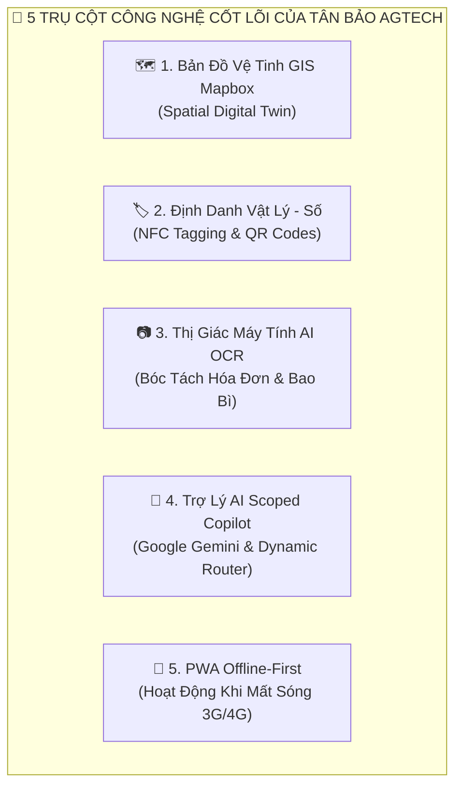
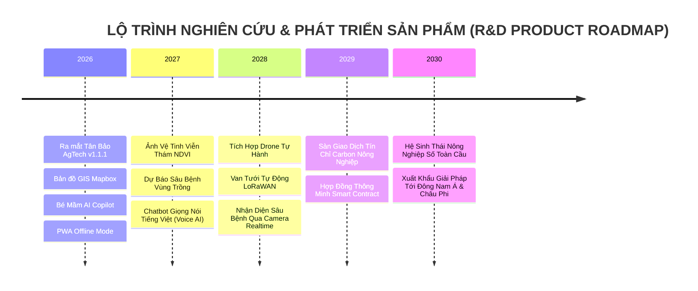

# SÁCH KỸ THUẬT & NGHIÊN CỨU PHÁT TRIỂN SẢN PHẨM (R&D WHITEPAPER)
## KỶ NGUYÊN SỐ HÓA NÔNG NGHIỆP: HỆ THỐNG SỔ NÔNG ĐIỆN TỬ, BẢN ĐỒ GIS & TRỢ LÝ AI AGTECH
*(THE DIGITAL AGTECH COMPENDIUM: ARCHITECTURE, OPERATION & FUTURE R&D ROADMAP)*

```
========================================================================================================
TỔNG CÔNG TY NÔNG NGHIỆP CÔNG NGHỆ CAO TÂN BẢO (TANBAO AGTECH CORPORATION)
MÃ XUẤT BẢN: ISBN-AGTECH-2026-TB | PHIÊN BẢN HỆ THỐNG: Release v1.1.1 | NĂM XUẤT BẢN: 2026
ĐƠN VỊ CHỦ QUẢN: VIỆN NGHIÊN CỨU VÀ PHÁT TRIỂN CÔNG NGHỆ NÔNG NGHIỆP SỐ TÂN BẢO
========================================================================================================
```

---

# LỜI TỰA: CHUYỂN ĐỔI SỐ NÔNG NGHIỆP — TỪ KHÁT VỌNG ĐẾN THỰC THI

Nền nông nghiệp Việt Nam đang bước vào giai đoạn chuyển mình mang tính lịch sử: Chuyển dịch mạnh mẽ từ phương thức canh tác truyền thống dựa trên kinh nghiệm cảm tính sang nền **Nông nghiệp Chính xác (Precision Agriculture)** dựa trên dữ liệu thời gian thực và trí tuệ nhân tạo. 

Cuốn sách này là công trình nghiên cứu và đúc kết toàn diện từ hàng ngàn giờ thử nghiệm thực địa tại các vùng chuyên canh cây ăn trái giá trị cao (Sầu riêng, Bưởi da xanh, Bơ, Mít) tại Đồng bằng sông Cửu Long và Tây Nguyên. Chúng tôi xây dựng cuốn sách này như một bản kim chỉ nam kỹ thuật, cẩm nang vận hành và lộ trình nghiên cứu phát triển (R&D) dành cho các kỹ sư công nghệ, nhà quản trị hợp tác xã, chuyên gia nông học và toàn thể bà con nông dân.

---

# CHƯƠNG 1: Ý NGHĨA KINH TẾ - XÃ HỘI VÀ TẦM NHÌN SẢN PHẨM

### 1.1 Giải Quyết 4 Nỗi Đau Lớn Của Ngành Nông Nghiệp Truyền Thống
1. **Đứt Gãy Dữ Liệu Thực Địa & Rủi Ro Gian Lận:** Việc ghi chép bằng sổ giấy truyền thống dẫn đến hơn 80% dữ liệu bị thất lạc hoặc ghi bù sai lệch, không đáp ứng được yêu cầu thanh tra nghiêm ngặt của các thị trường xuất khẩu cao cấp (EU, Mỹ, Nhật Bản, Trung Quốc).
2. **Lãng Phí Chi Phí & Thoái Hóa Đất:** Thói quen bón phân, phun thuốc theo cảm tính gây lãng phí 20% - 35% chi phí vật tư hàng năm và làm suy thoái hệ vi sinh vật đất.
3. **Sự Thiếu Hụt Chuyên Gia Nông Nghiệp Hiện Trường:** Tỷ lệ kỹ sư nông nghiệp trên số lượng nông hộ quá thấp khiến việc chẩn đoán dịch bệnh bị chậm trễ từ 3-5 ngày, gây thiệt hại nghiêm trọng khi dịch hại bùng phát.
4. **Khó Khăn Trong Quản Trị Chuỗi Cung Ứng & Hợp Tác Xã:** Ban quản trị HTX và Doanh nghiệp chế biến không thể nắm bắt được tiến độ mùa vụ, sản lượng dự kiến và chi phí đầu tư của từng hộ liên kết.

### 1.2 Giá Trị Kinh Tế Đo Lường Được (Measurable ROI)
* **Tiết kiệm 20% - 30% chi phí phân bón & thuốc BVTV:** Nhờ công nghệ bóc tách hóa đơn OCR, đối soát định mức và khuyến cáo chuẩn VietGAP.
* **Gia tăng 15% - 25% giá trị nông sản:** Nhờ tem mã QR truy xuất nguồn gốc số học gắn liền với lý lịch từng gốc cây.
* **Tiết kiệm 90% thời gian tổng hợp báo cáo:** Hệ thống tự động trích xuất báo cáo tài chính và hồ sơ kiểm toán mùa vụ chỉ sau 1 cú nhấp chuột.

---

# CHƯƠNG 2: NỀN TẢNG CÔNG NGHỆ ĐỘT PHÁ CỦA HỆ THỐNG



1. **Bản đồ Số Không Gian GIS Mapbox (Spatial Digital Twin):** Số hóa từng thửa đất bằng ranh giới Polygon, gắn tọa độ GPS của từng gốc cây lên ảnh vệ tinh độ phân giải cao, kết nối trực tiếp với trạm dự báo thời tiết 6 ngày.
2. **Định danh Vật lý - Số hóa (Phygital NFC & QR Codes):** Gắn chip NFC và tem mã QR chống nước ngoài trời lên thân cây, biến mỗi gốc cây thành một thực thể số có lý lịch sinh trưởng riêng biệt.
3. **Thị giác Máy tính AI OCR (Vision AI Parser):** Sử dụng trí tuệ nhân tạo để đọc chữ trên bao bì thuốc và hóa đơn mua hàng, tự động trích xuất hoạt chất, quy cách đóng gói và đơn giá.
4. **Trợ lý AI Bé Mầm & Điều hướng Mô hình Động:** Phân luồng câu hỏi thông minh, ưu tiên model tiết kiệm quota cho câu hỏi thường và triệu hồi model Flagship cho câu hỏi khó; bảo mật tuyệt đối dữ liệu theo từng tài khoản nông hộ.
5. **Kiến trúc PWA Offline-First:** Bộ nhớ đệm IndexedDB cho phép ghi chép ngoài vườn cây khi mất mạng và tự động đồng bộ nền khi có Wifi.

---

# CHƯƠNG 3: CẨM NANG VẬN HÀNH & HƯỚNG DẪN SỬ DỤNG TOÀN DIỆN

### 3.1 Quy Trình 4 Bước Bắt Đầu Dành Cho Nông Hộ (Farmer Manual)
* **Bước 1: Khởi tạo Trang Trại Mới:** Vào menu **"Trang trại"** ➔ Bấm **"+ Khởi tạo Trang trại mới (GPS)"** ➔ Điền tên vườn, diện tích và bấm **"Lấy GPS"** để hệ thống tự động ghim vị trí vệ tinh và kết nối trạm thời tiết 6 ngày.
* **Bước 2: Thêm Cây Trồng & Gán Mã:** Vào trang trại ➔ Bấm **"+ Thêm cây"** ➔ Nhập mã cây (VD: `SR-001`), chọn giống cây và định vị trên bản đồ GIS hoặc quét thẻ NFC/QR.
* **Bước 3: Ghi Nhật Ký 1-Chạm Qua Bé Mầm:** Chạm vào biểu tượng **Bé Mầm Ôm Nút Dấu Cộng (+)** ở góc dưới màn hình ➔ Chọn **"📝 Ghi nhật ký chăm sóc"** ➔ Lưu việc tưới nước, bón phân NPK, phun thuốc BVTV và chụp ảnh hiện trường.
* **Bước 4: Quản Lý Vật Tư & Hạch Toán Chi Phí:** Vào mục **"Vật tư"** ➔ Chụp ảnh bao bì phân thuốc để AI OCR tự động tính toán tổng chi phí mùa vụ.

### 3.2 Quy Trình Quản Trị Dành Cho Doanh Nghiệp & Hợp Tác Xã (Admin Manual)
* **Quản trị Bản đồ GIS:** Vẽ ranh giới Polygon thửa đất, đo đạc diện tích tự động và phân bổ lô cây cho từng nông hộ.
* **Giám sát Trạm IoT:** Theo dõi thời gian thực độ ẩm đất và vi khí hậu; thiết lập bộ quy tắc cảnh báo tưới tiêu và phòng trừ sâu bệnh tự động.
* **Phê duyệt Nông hộ 3 bước:** Kiểm tra hồ sơ, cấp mã định danh bảo mật ISO Public ID (`usr-xxx`) và phân quyền trang trại.
* **Kiểm toán Chi phí & Cấp mã QR Truy xuất:** Xuất báo cáo chứng nhận VietGAP phục vụ đóng gói và xuất khẩu nông sản.

---

# CHƯƠNG 4: HƯỚNG NGHIÊN CỨU & PHÁT TRIỂN TRONG TƯƠNG LAI (R&D ROADMAP)



### 🚀 Giai Đoạn 1 (2026 - 2027): Ảnh Vệ Tinh Viễn Thám & Trợ Lý Giọng Nói Nông Dân
* **Chỉ số thảm thực vật NDVI (Normalized Difference Vegetation Index):** Tích hợp dữ liệu viễn thám từ vệ tinh Sentinel-2 và Landsat-8/9 để phân tích sức khỏe tán lá, độ ẩm tầng đất trên diện rộng hàng ngàn hecta, phát hiện sớm các vùng cây bị stress nước hoặc thiếu hụt diệp lục tố.
* **Voice AI Engine (Trợ lý Giọng nói Bản địa):** Cho phép nông dân lớn tuổi trực tiếp "nói chuyện" với Bé Mầm bằng giọng nói tiếng Việt đa vùng miền (Bắc, Trung, Nam, Miền Tây) để ghi nhật ký mà không cần chạm tay vào màn hình khi đang làm vườn.

### 🚀 Giai Đoạn 2 (2027 - 2028): Tự Động Hóa Nông Trại Bằng Drone & IoT LoRaWAN
* **Điều khiển Drone Phun thuốc Tự hành:** Lập trình lộ trình bay tự động cho Drone dựa trên bản đồ GIS cây bệnh được trích xuất từ nhật ký số.
* **Hệ thống Van tưới thông minh LoRaWAN:** Tự động mở van tưới nhỏ giọt khi cảm biến IoT tầng rễ báo độ ẩm đất tụt xuống dưới ngưỡng 60% và tự ngắt khi đạt 75%.
* **Computer Vision Edge AI:** Tích hợp mô hình AI nhận diện sâu bệnh trực tiếp trên camera điện thoại với độ trễ <0.1 giây không cần kết nối internet.

### 🚀 Giai Đoạn 3 (2028 - 2030): Tín Chỉ Carbon Nông Nghiệp & Nông Nghiệp Tuần Hoàn
* **Sàn Giao Dịch Tín Chỉ Carbon Nông Nghiệp (Agri-Carbon Marketplace):** Đo lường lượng khí nhà kính giảm phát thải từ việc cắt giảm phân bón vô cơ và quản lý nước thông minh, chuyển hóa thành Tín chỉ Carbon đạt chuẩn quốc tế (Verra / Gold Standard) để bán cho các tập đoàn đa quốc gia.
* **Hợp đồng Thông minh Blockchain (Smart Contracts):** Tự động giải ngân nguồn vốn vay ưu đãi nông nghiệp từ ngân hàng khi nông hộ hoàn thành đầy đủ các mốc nhật ký canh tác chuẩn VietGAP.

---

# CHƯƠNG 5: MÔ HÌNH KINH DOANH VÀ CHIẾN LƯỢC THƯƠNG MẠI HÓA

### 5.1 Cấu Trúc Các Gói Sản Phẩm (Product Pricing Tiers)
1. **Gói Nông Hộ Khởi Nghiệp (Freemium - Miễn phí vĩnh viễn):**
   * Dành cho hộ nông dân canh tác nhỏ lẻ (< 100 cây trồng).
   * Bao gồm: Bản đồ GIS cơ bản, Ghi nhật ký qua Bé Mầm, 50 lượt chat AI/tháng, 10 lượt quét OCR/tháng.
2. **Gói Nông Hộ Chuyên Nghiệp (Pro Farmer - 99.000 VNĐ / tháng):**
   * Dành cho các chủ trang trại lớn (500 - 3.000 cây).
   * Bao gồm: Quét OCR không giới hạn, Trợ lý AI Flagship 3.7 không giới hạn, Dự báo thời tiết vi khí hậu chuyên sâu, Xuất báo cáo VietGAP xuất khẩu.
3. **Gói Doanh Nghiệp & Hợp Tác Xã (Enterprise SaaS - Theo quy mô):**
   * Dành cho Hợp tác xã, Tập đoàn Nông nghiệp và Doanh nghiệp Thu mua Xuất khẩu.
   * Bao gồm: Admin Command Center toàn quyền, Giám sát trạm quan trắc IoT không giới hạn, Tích hợp hệ thống ERP/Kho vận, Đào tạo và hỗ trợ kỹ thuật 24/7.

### 5.2 Chiến Lược Go-To-Market (GTM Strategy)
* **Kênh Tiếp cận Hợp Tác Xã & Khuyến Nông:** Phối hợp cùng Trung tâm Khuyến nông các tỉnh (Tiền Giang, Bến Tre, Đắk Lắk, Lâm Đồng) tổ chức các buổi tập huấn "Chuyển đổi số nông nghiệp 1-chạm".
* **Mạng Lưới Đại Lý Vật Tư Nông Nghiệp:** Hợp tác cùng các đại lý phân bón/thuốc BVTV uy tín để in mã QR cài đặt ứng dụng ngay trên bao bì sản phẩm.
* **Mục tiêu 2026 - 2028:** Phủ sóng **100.000 nông hộ** và số hóa **50.000 hecta** cây ăn trái xuất khẩu trên toàn quốc.

---

> **LỜI KẾT:**  
> Kỷ nguyên số hóa nông nghiệp không chỉ là câu chuyện của công nghệ, mà là hành trình nâng cao giá trị hạt gạo, trái sầu riêng, quả bưởi và cải thiện sinh kế bền vững cho hàng triệu người nông dân Việt Nam. **Tân Bảo AgTech Corporation** cam kết không ngừng đổi mới sáng tạo để đưa nông nghiệp Việt Nam vươn tầm thế giới!
