# HỒ SƠ THIẾT KẾ KỸ THUẬT TOÀN DIỆN HỆ THỐNG SỔ NÔNG SỐ & TRỢ LÝ AI TÂN BẢO AGTECH v1.1.1
## (ENTERPRISE TECHNICAL SYSTEM SPECIFICATION & ARCHITECTURAL BLUEPRINT)

```
========================================================================================================
TỔNG CÔNG TY NÔNG NGHIỆP CÔNG NGHỆ CAO TÂN BẢO (TANBAO AGTECH CORPORATION)
MÃ TÀI LIỆU: TDD-TB-AGTECH-2026 | PHIÊN BẢN HỆ THỐNG: v1.1.1 | NGÀY BAN HÀNH: 25/08/2026
QUY CHUẨN KỸ THUẬT: IEEE 1016-2009, ISO/IEC 25010, TOGAF 9.2, VIETGAP / GLOBALGAP, ISO/IEC 11558
========================================================================================================
```

---

# MỤC LỤC TỔNG QUAN

1. **CHƯƠNG I: TỔNG QUAN HẠ TẦNG PHÂN TẦNG VÀ DÒNG CHẢY DỮ LIỆU**
2. **CHƯƠNG II: MA TRẬN PHÂN QUYỀN VÀ QUẢN TRỊ NGƯỜI DÙNG (USER VS ADMIN)**
3. **CHƯƠNG III: ĐẶC TẢ CHI TIẾT TỪNG TÍNH NĂNG VÀ SƠ ĐỒ QUY TRÌNH VẬN HÀNH (12 DIAGRAMS)**
   * *Tính năng 1:* Xác thực JWT, Cấp mã ISO Hash ID & Phân luồng Dữ liệu Scoped
   * *Tính năng 2:* Khởi tạo Trang trại Vệ tinh GPS & Bản đồ Ranh giới GIS Mapbox
   * *Tính năng 3:* Số hóa Cây trồng (Tree Digital Twin) & Gán Thẻ NFC/Mã QR Thực địa
   * *Tính năng 4:* Tương tác 1-Chạm "Bé Mầm Ôm Nút Dấu Cộng (+)" & Menu 2 Hành động
   * *Tính năng 5:* Ghi Nhật ký Canh tác Thực địa & Kiểm soát Cảnh báo PHI VietGAP
   * *Tính năng 6:* Camera AI OCR Quét Hóa đơn/Bao bì & Tự động Tính Chi phí, Trừ Kho
   * *Tính năng 7:* Trợ lý AI Bé Mầm - Điều hướng Mô hình Động & Chuỗi Auto-Failover
   * *Tính năng 8:* Trạm Quan trắc IoT Đất/Khí tượng & Bộ Quy tắc Cảnh báo Sớm (Rule Engine)
   * *Tính năng 9:* PWA Offline-First, Bộ nhớ Đệm IndexedDB & Đồng bộ Dữ liệu Nền
   * *Tính năng 10:* Executive Admin Command Center & Phê duyệt Nông hộ 3 Bước
   * *Tính năng 11:* Mô hình Quan hệ Thực thể Cơ sở Dữ liệu Toàn diện (Complete ERD)
   * *Tính năng 12:* Kiến trúc Bộ nhớ đệm Redis & Chiến lược Chịu tải 5.000 - 50.000 Users
4. **CHƯƠNG IV: QUY TẮC VẬN HÀNH, BẢO MẬT VÀ NGUYÊN TẮC BẢO TRÌ HỆ THỐNG**

---

# CHƯƠNG I: TỔNG QUAN HẠ TẦNG PHÂN TẦNG VÀ DÒNG CHẢY DỮ LIỆU

Hệ thống **Sổ Nông Số Tân Bảo AgTech v1.1.1** được xây dựng theo kiến trúc **Module-Monolith hiệu năng cao**, tối ưu hóa để vận hành tại các vùng nông nghiệp có hạ tầng viễn thông hạn chế nhưng vẫn đảm bảo khả năng mở rộng quy mô lớn cho doanh nghiệp.

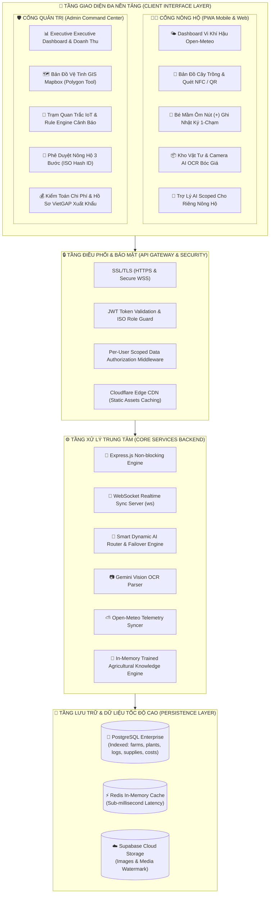

---

# CHƯƠNG II: MA TRẬN PHÂN QUYỀN VÀ QUẢN TRỊ NGƯỜI DÙNG (USER VS ADMIN)

Hệ thống thiết lập cơ chế cô lập dữ liệu nghiêm ngặt (**Per-User Scoped Data Isolation**) nhằm đảm bảo tính bảo mật và quyền riêng tư thương mại giữa các nông hộ thành viên:

| Hạng mục So sánh | 🧑‍🌾 CỔNG NÔNG HỘ (USER PORTAL) | 🛡️ CỔNG QUẢN TRỊ (ADMIN COMMAND CENTER) |
| :--- | :--- | :--- |
| **Phạm vi Dữ liệu (Data Scope)** | **Cô lập 100% (Scoped Data):** Chỉ có quyền đọc và ghi dữ liệu đối với các trang trại do tài khoản mình sở hữu (1 hoặc nhiều trang trại). Tuyệt đối không nhìn thấy trang trại của hộ khác. | **Toàn quyền hệ thống (Global Scope):** Xem toàn bộ danh sách trang trại, tổng số cây trồng, tổng sản lượng, tổng chi phí vật tư toàn công ty. |
| **Cấu trúc Định danh** | Mã Obfuscation chuẩn ISO: `usr-xxxxxxxx` (VD: `usr-10492817`) | Mã Obfuscation chuẩn ISO: `adm-xxxxxxxx` (VD: `adm-58291034`) |
| **Giao diện Bé Mầm AI** | **Sprite Bé Mầm Ôm Nút Dấu Cộng (+):** Chạm vào mở menu 2 khối (Ghi nhật ký / Chat AI). Trả lời dữ liệu riêng của nông hộ. | **Bé Mầm Chibi HUD Quản Trị:** Nhấn vào mở khung chat hỏi đáp tổng quan hệ thống, kiểm tra cảm biến IoT và số liệu toàn công ty. |
| **Quyền Thao tác Bản đồ** | Xem vị trí các gốc cây, quét NFC/QR và định vị cây trồng trong trang trại của mình. | Vẽ ranh giới Polygon lô đất, đo diện tích tự động, phân bổ cây trồng và quản trị đa trang trại. |
| **Quản lý Vật tư & Chi phí** | Quét OCR hóa đơn/bao bì, nhập kho phân thuốc cá nhân, tự động tính chi phí mùa vụ trang trại. | Kiểm toán chi phí toàn bộ các trang trại, xuất báo cáo tài chính và hồ sơ truy xuất nguồn gốc VietGAP. |

---

# CHƯƠNG III: ĐẶC TẢ CHI TIẾT TỪNG TÍNH NĂNG VÀ SƠ ĐỒ VẬN HÀNH

---

### 1. TÍNH NĂNG 1: XÁC THỰC JWT, CẤP MÃ ISO HASH ID & PHÂN LUỒNG DỮ LIỆU SCOPED

* **Mục đích:** Xác thực danh tính người dùng, cấp mã định danh ẩn danh an toàn và cô lập truy vấn CSDL theo quyền sở hữu.
* **Quy tắc phân luồng:**
  * Request gửi kèm Header: `Authorization: Bearer <token>`.
  * Middleware `auth.js` giải mã token ➔ Lấy `req.user = { id, email, role, name, farm_id }`.
  * Nếu `role === 'admin'` ➔ Truy vấn toàn bộ bảng `farms`, `plants`, `supplies`.
  * Nếu `role === 'user'` ➔ Tự động gắn điều kiện `WHERE (f.user_id = $1 OR f.id = (SELECT farm_id FROM users WHERE id = $1))`.

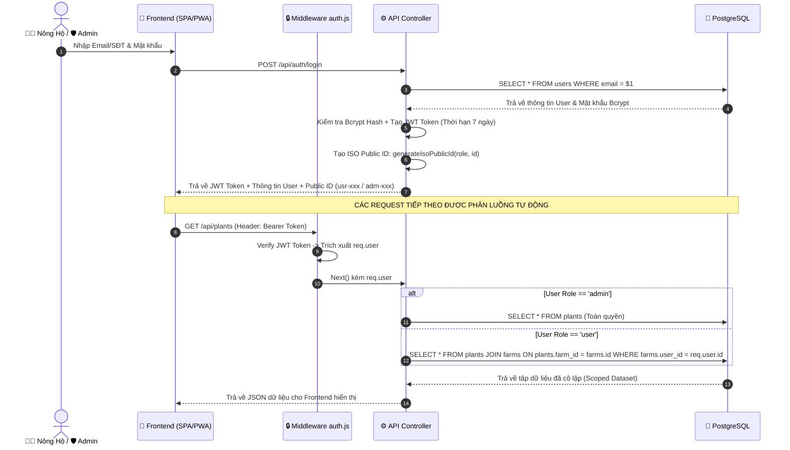

---

### 2. TÍNH NĂNG 2: KHỞI TẠO TRANG TRẠI VỆ TINH GPS & BẢN ĐỒ RANH GIỚI GIS MAPBOX

* **Mục đích:** Số hóa không gian địa lý của nông trại, lấy tọa độ GPS chính xác và vẽ ranh giới Polygon vệ tinh.
* **Quy trình vận hành:**
  1. Nông hộ đứng tại vườn, nhấn **"Lấy GPS"** ➔ Trình duyệt kích hoạt `navigator.geolocation.getCurrentPosition()`.
  2. Hệ thống ghim tọa độ trung tâm vườn lên bản đồ vệ tinh Mapbox GL JS v3.
  3. Quản trị viên sử dụng công cụ vẽ Polygon (Mapbox Draw) để xác định đường biên giới thửa đất, hệ thống tự động tính toán diện tích (Hecta).
  4. Kết nối ngay lập tức trạm khí tượng vệ tinh Open-Meteo theo tọa độ Lat/Long để lấy dự báo mưa, nhiệt độ, độ ẩm 6 ngày.

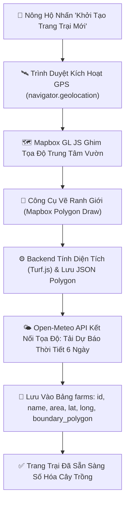

---

### 3. TÍNH NĂNG 3: SỐ HÓA CÂY TRỒNG (TREE DIGITAL TWIN) & GÁN THẺ NFC/MÃ QR

* **Mục đích:** Tạo "Lý lịch số học" cho từng gốc cây trong vườn, quản lý tuổi cây, giống cây, tọa độ vi trí và liên kết chip NFC/tem mã QR chống nước.

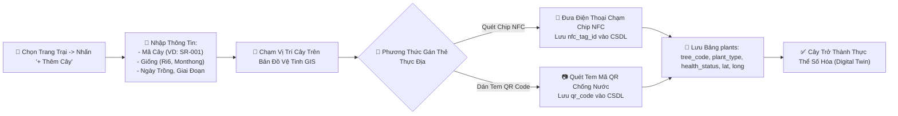

---

### 4. TÍNH NĂNG 4: TƯƠNG TÁC 1-CHẠM "BÉ MẦM ÔM NÚT DẤU CỘNG (+)" & MENU 2 HÀNH ĐỘNG

* **Mục đích:** Tối giản hóa tối đa trải nghiệm người dùng ngoài thực địa, gom toàn bộ thao tác nhanh vào một Sprite Chibi 3D duy nhất.
* **Cơ chế hoạt động:**
  * Biểu tượng Bé Mầm ôm trọn nút tròn dấu cộng `(+)` hiển thị nổi bật ở góc dưới bên phải màn hình.
  * Khi người dùng chạm vào (Click Event), hệ thống kích hoạt `e.stopPropagation()` để ngăn chặn đóng nhầm, đồng thời mở Popup Menu 2 Khối sang trọng:
    * **Khối 1: [📝 Ghi nhật ký chăm sóc]** ➔ Kích hoạt Care Modal.
    * **Khối 2: [🌱 Bé Mầm tư vấn & hỏi đáp]** ➔ Mở Chatbox AI Gemini.

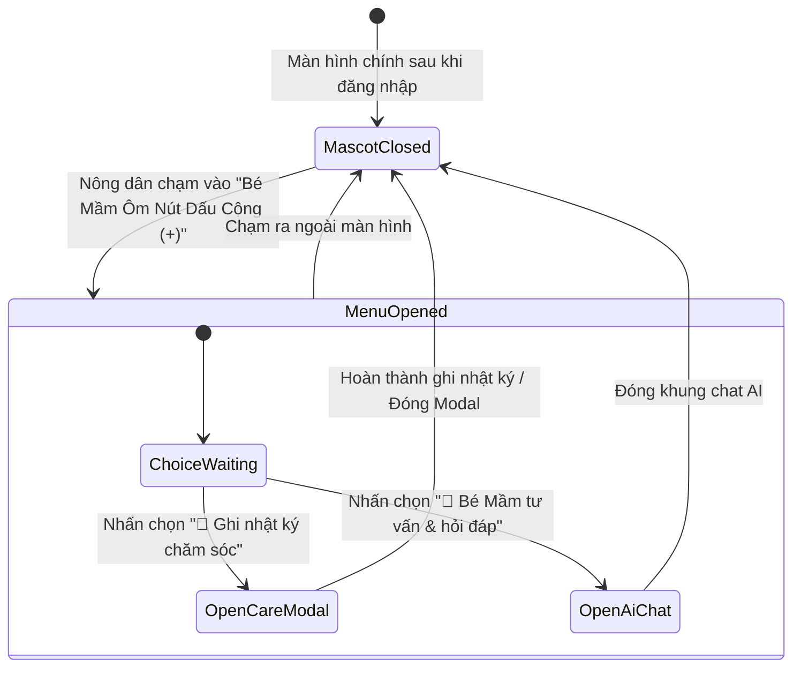

---

### 5. TÍNH NĂNG 5: GHI NHẬT KÝ CANH TÁC THỰC ĐỊA & KIỂM SOÁT CẢNH BÁO PHI VIETGAP

* **Mục đích:** Ghi nhận chính xác lượng nước tưới, loại phân NPK, thuốc BVTV, cắt tỉa cành, đồng thời tự động kích hoạt **Cảnh báo Đỏ** nếu vi phạm thời gian cách ly thu hoạch (PHI).

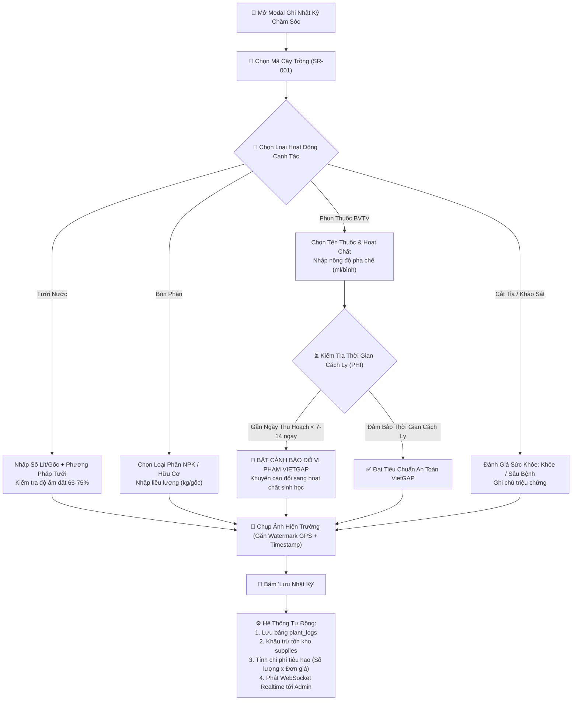

---

### 6. TÍNH NĂNG 6: CAMERA AI OCR QUÉT HÓA ĐƠN/BAO BÌ & TỰ ĐỘNG TÍNH CHI PHÍ, TRỪ KHO

* **Mục đích:** Loại bỏ hoàn toàn việc gõ tay hóa đơn phức tạp, sử dụng Vision AI để tự động bóc tách tên thuốc, hoạt chất, quy cách và đơn giá.

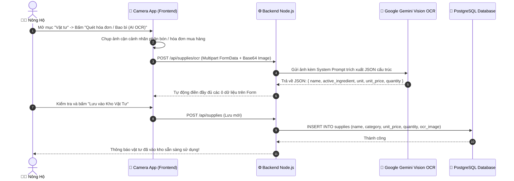

---

### 7. TÍNH NĂNG 7: TRỢ LÝ AI BÉ MẦM - ĐIỀU HƯỚNG MÔ HÌNH ĐỘNG & AUTO-FAILOVER

* **Mục đích:** Phân loại độ khó câu hỏi thông minh, ưu tiên model tiết kiệm quota cho câu hỏi dễ và điều hướng model Flagship cho câu hỏi khó, tự động failover sang CSDL nội bộ khi mất mạng.

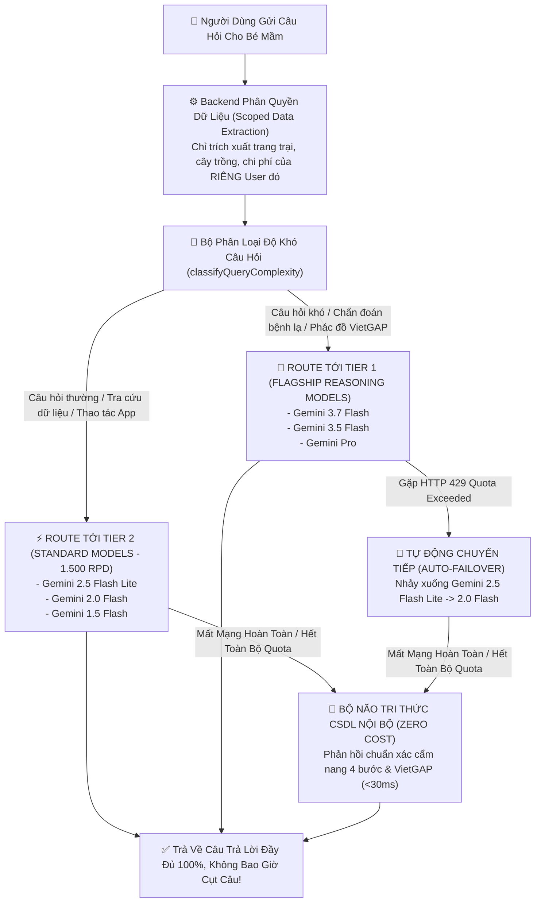

---

### 8. TÍNH NĂNG 8: TRẠM QUAN TRẮC IoT ĐẤT/KHÍ TƯỢNG & BỘ QUY TẮC CẢNH BÁO SỚM (RULE ENGINE)

* **Mục đích:** Tiếp nhận dữ liệu độ ẩm đất, nhiệt độ khí quyển từ các đầu đo IoT theo thời gian thực và kích hoạt cảnh báo thông minh.

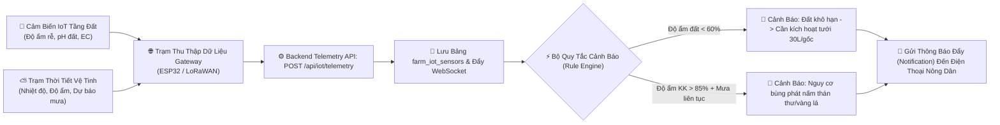

---

### 9. TÍNH NĂNG 9: PWA OFFLINE-FIRST, BỘ NHỚ ĐỆM INDEXEDDB & ĐỒNG BỘ NỀN

* **Mục đích:** Đảm bảo nông dân vẫn ghi chép và chụp ảnh bình thường kể cả khi đang đứng ở vùng đồi dốc mất hoàn toàn sóng 3G/4G.

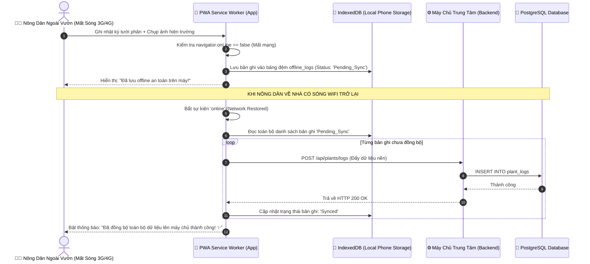

---

### 10. TÍNH NĂNG 10: EXECUTIVE ADMIN COMMAND CENTER & PHÊ DUYỆT NÔNG HỘ 3 BƯỚC

* **Mục đích:** Giúp Ban Quản trị Hợp tác xã/Doanh nghiệp phê duyệt tài khoản nông hộ mới, phân quyền trang trại và kiểm soát chất lượng dữ liệu.

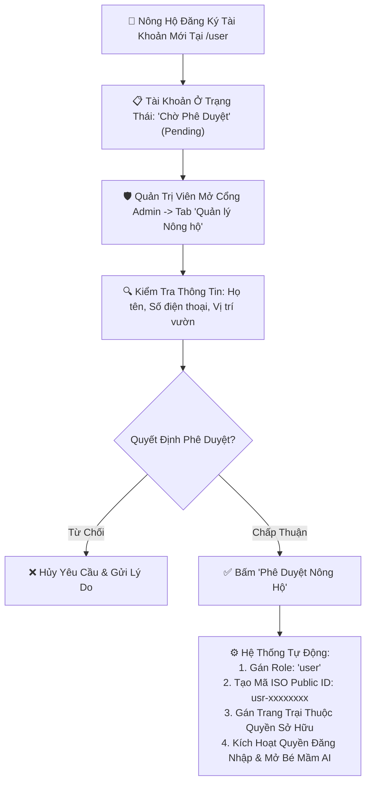

---

### 11. TÍNH NĂNG 11: MÔ HÌNH QUAN HỆ THỰC THỂ CƠ SỞ DỮ LIỆU TOÀN DIỆN (COMPLETE ERD)

* **Mục đích:** Quản lý toàn vẹn dữ liệu quan hệ ACID trên PostgreSQL Enterprise.

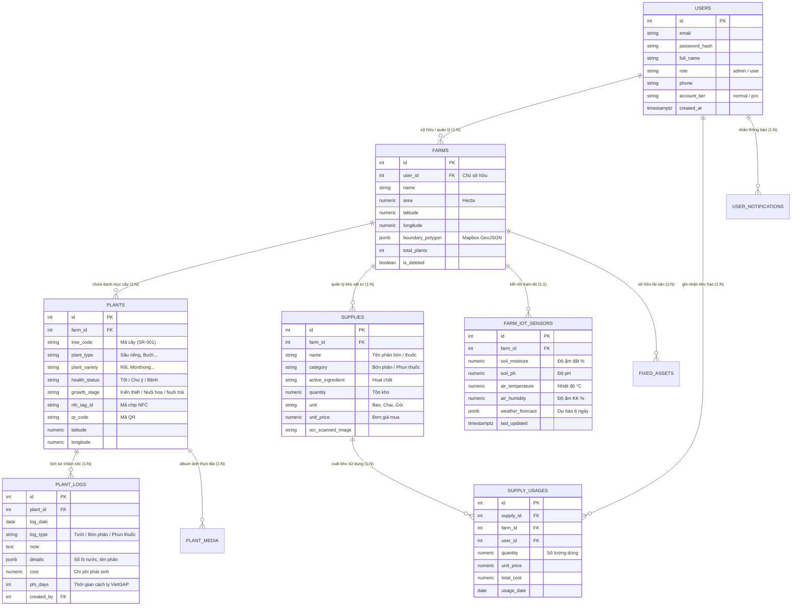

---

### 12. TÍNH NĂNG 12: KIẾN TRÚC BỘ NHỚ ĐỆM REDIS & CHIẾN LƯỢC CHỊU TẢI 5.000 - 50.000 USERS

* **Mục đích:** Tối ưu hóa hiệu năng, giảm tải 85% truy vấn CSDL PostgreSQL và duy trì thời gian phản hồi <15ms khi có hàng ngàn nông hộ đồng loạt truy cập.

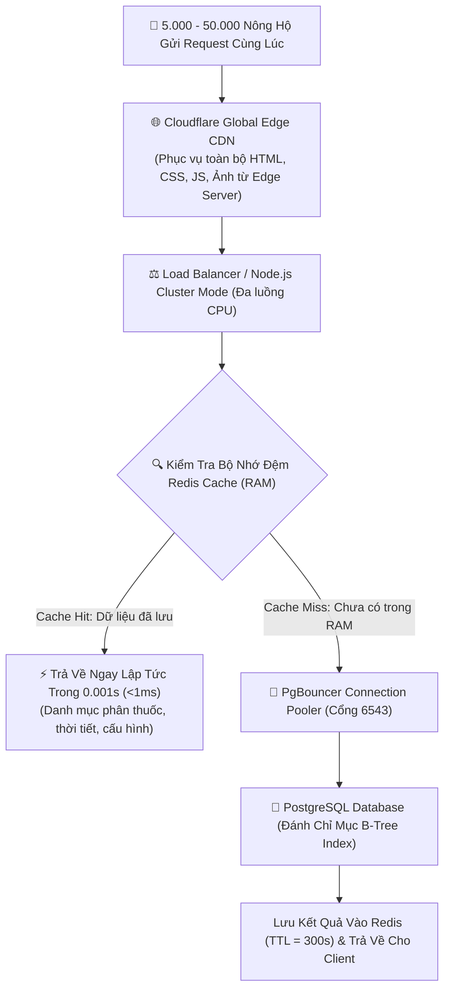

---

# CHƯƠNG IV: QUY TẮC VẬN HÀNH, BẢO MẬT VÀ NGUYÊN TẮC BẢO TRÌ HỆ THỐNG

### 1. NGUYÊN TẮC BẢO MẬT & TOÀN VẸN DỮ LIỆU (DATA INTEGRITY & SECURITY)
* **Bảo vệ đường truyền:** 100% kết nối Web và WebSocket bắt buộc chạy qua giao thức mã hóa **HTTPS / WSS (TLS 1.3)**.
* **Mã hóa mật khẩu:** Sử dụng thuật toán `bcryptjs` với hệ số Salt Rounds = 10.
* **Khóa bất biến dữ liệu kiểm toán (Audit Trail):** Mọi bản ghi nhật ký canh tác khi đã được Kỹ thuật viên ký duyệt sẽ bị khóa cờ `is_locked = TRUE`, không cho phép sửa đổi tùy tiện nhằm bảo vệ giá trị pháp lý của chứng nhận VietGAP.

### 2. QUY ĐỊNH SAO LƯU DỮ LIỆU & PHỤC HỒI THẢM HỌA (DISASTER RECOVERY)
* **Sao lưu tự động:** Hệ thống kích hoạt Cron Job tự động xuất bản sao lưu CSDL PostgreSQL (`pg_dump`) mỗi ngày vào lúc 02:00 AM, nén mã hóa và đẩy lên bộ lưu trữ đám mây độc lập.
* **Mục tiêu phục hồi:**
  * **RPO (Recovery Point Objective):** < 24 giờ.
  * **RTO (Recovery Time Objective):** < 30 phút.

---

> **PHÊ DUYỆT & BAN HÀNH:**  
> Hồ sơ thiết kế kỹ thuật này là tài sản trí tuệ và tài liệu quy chuẩn kỹ thuật chính thức của **Công ty Cổ phần Nông nghiệp Công nghệ cao Tân Bảo**. Toàn bộ các phiên bản phát triển, mở rộng module tiếp theo bắt buộc phải tuân thủ nghiêm ngặt theo kiến trúc này.
