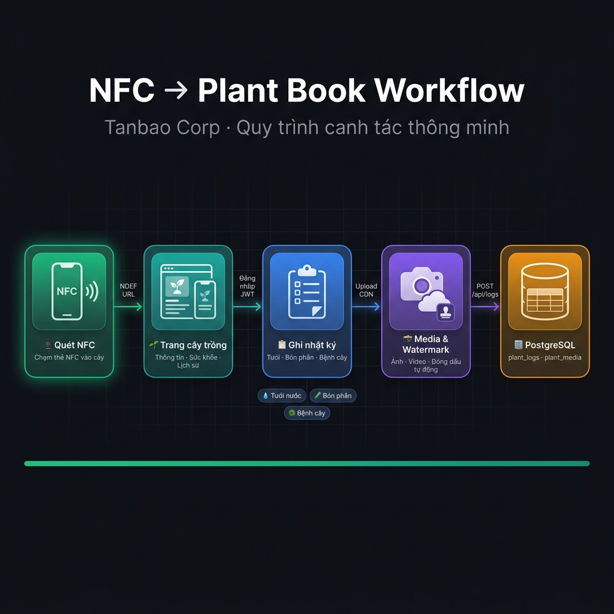
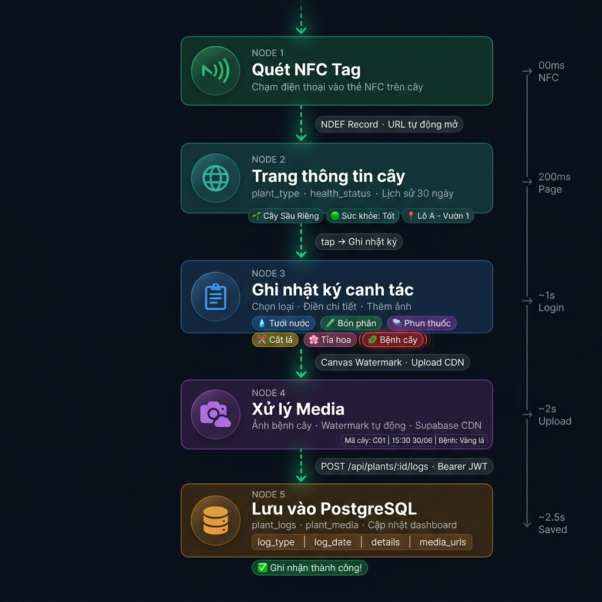

# 📱 NFC → Plant Book — Workflow Diagram

> **Tanbao Corp** · Quy trình canh tác thông minh

---

## Tổng quan

---

## Quy trình chi tiết

---

## 5 bước chính

| Bước | Giai đoạn | Mô tả |
|------|-----------|-------|
| 1️⃣ | **Quét NFC** | Chạm điện thoại vào thẻ NFC gắn trên cây → Trình duyệt tự mở URL |
| 2️⃣ | **Trang cây trồng** | Xem thông tin loại cây, sức khỏe, lịch sử 30 ngày |
| 3️⃣ | **Ghi nhật ký** | Chọn hoạt động (Tưới · Bón phân · Bệnh cây ...) → Điền chi tiết |
| 4️⃣ | **Xử lý Media** | Chụp ảnh bệnh → Watermark tự động → Upload Supabase CDN |
| 5️⃣ | **Lưu Database** | `POST /api/plants/:id/logs` → PostgreSQL `plant_logs` |

---

*Plant Book — Tanbao Corp · 01/07/2026*
