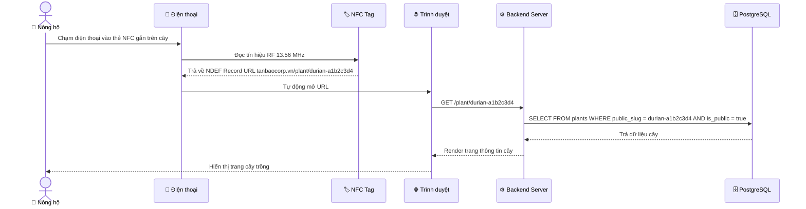
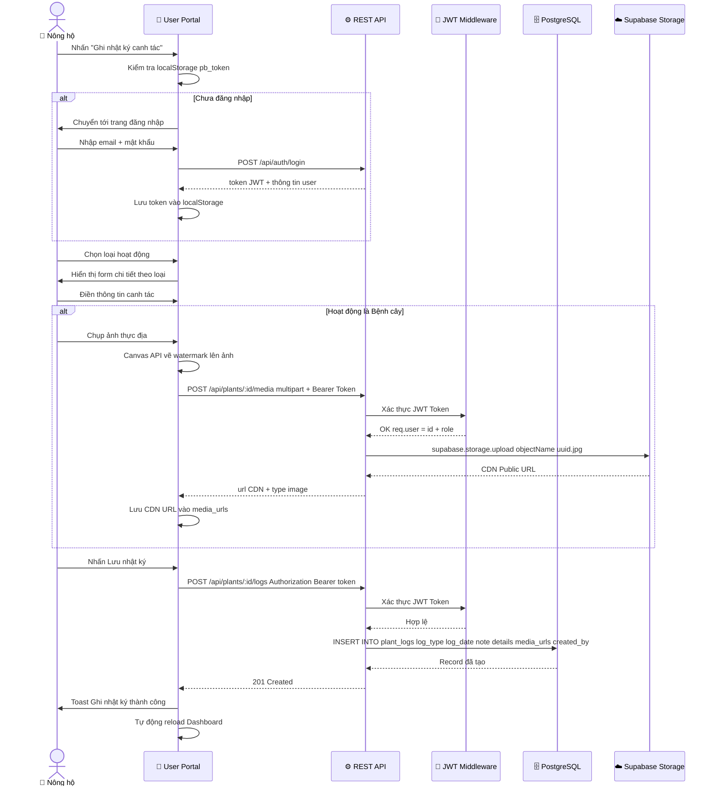
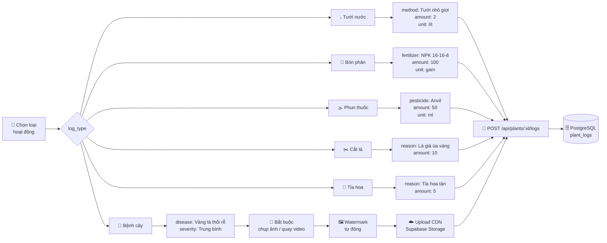
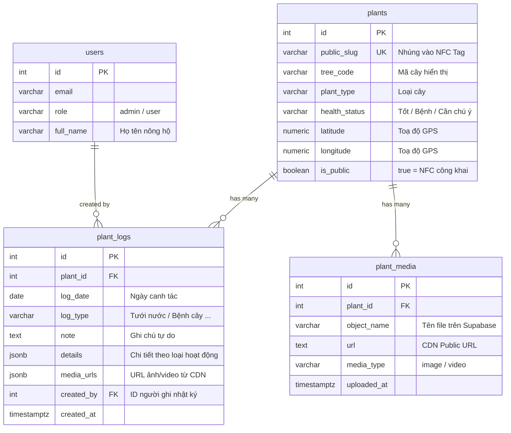
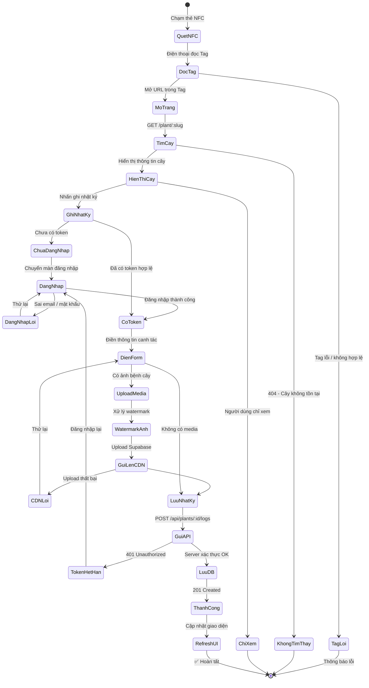
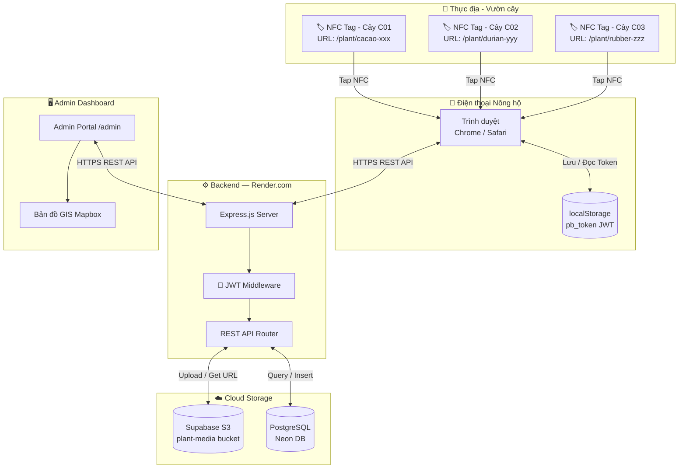

# 📱 Quy trình NFC → Plant Book
> **Tanbao Corp** · Hệ thống Quản lý Vườn Cây Thông minh

Tài liệu này mô tả toàn bộ luồng kỹ thuật từ khi **người dùng chạm thẻ NFC** vào điện thoại cho đến khi dữ liệu canh tác được **lưu trữ thành công vào cơ sở dữ liệu**.

---

## 1. Tổng quan quy trình

```mermaid
flowchart TD
    A([📱 Người dùng chạm thẻ NFC\nvào điện thoại]) --> B[Điện thoại đọc\nNFC Tag]
    B --> C{Tag hợp lệ?}
    C -- ❌ Không --> D([⚠️ Báo lỗi:\nThẻ không nhận diện được])
    C -- ✅ Có --> E[Mở trình duyệt\ntới URL nhúng trong Tag]
    E --> F[/plant/:public_slug]
    F --> G[GET /api/plant/:slug\nLấy thông tin cây]
    G --> H{Cây tồn tại\nvà is_public = true?}
    H -- ❌ Không --> I([🚫 Trang 404:\nCây không tìm thấy])
    H -- ✅ Có --> J[🌿 Hiển thị trang\nThông tin Cây trồng]
    J --> K[Người dùng xem:\nLoại cây · Sức khỏe · Lịch sử chăm sóc]
    K --> L{Muốn ghi\nnhật ký canh tác?}
    L -- Không --> M([👀 Chỉ xem thông tin])
    L -- Có --> N[Nhấn nút\n✏️ Ghi nhật ký canh tác]
    N --> O{Đã đăng nhập?}
    O -- ❌ Chưa --> P[Chuyển hướng\ntới trang đăng nhập]
    P --> Q[Nhập Email + Mật khẩu]
    Q --> R[POST /api/auth/login]
    R --> S{Xác thực\nthành công?}
    S -- ❌ Thất bại --> T([🔒 Thông báo lỗi\nĐăng nhập])
    S -- ✅ --> U[Nhận JWT Token\nLưu vào localStorage]
    O -- ✅ Rồi --> V[Mở Modal\nGhi nhật ký chăm sóc]
    U --> V
    V --> W[Chọn loại hoạt động]
    W --> X[Điền thông tin\nchi tiết canh tác]
    X --> Y{Có ảnh/video\nbệnh cây?}
    Y -- Có --> Z[📸 Chụp ảnh / Chọn thư viện]
    Z --> AA[🖼️ Đóng dấu Watermark\nMã cây · Thời gian · Tên bệnh]
    AA --> AB[☁️ Upload lên\nSupabase Storage CDN]
    AB --> AC[Nhận CDN URL]
    AC --> AD
    Y -- Không --> AD[Nhấn\n💾 Lưu nhật ký]
    AD --> AE[POST /api/plants/:id/logs\nBearer JWT Token]
    AE --> AF{Server\nxác thực token?}
    AF -- ❌ --> AG([🔒 401 Unauthorized\nToken hết hạn / không hợp lệ])
    AF -- ✅ --> AH[Lưu vào\nPostgreSQL Database]
    AH --> AI[✅ Ghi nhận thành công!\nDashboard tự động cập nhật]
```

---

## 2. Chi tiết: NFC Tag & URL Scheme



---

## 3. Chi tiết: Ghi nhật ký Canh tác



---

## 4. Phân nhánh theo Loại hoạt động



---

## 5. Cấu trúc dữ liệu lưu vào Database



---

## 6. Trạng thái hệ thống & xử lý lỗi



---

## 7. Kiến trúc tổng thể hệ thống NFC



---

## 8. Tóm tắt nhanh (Quick Reference)

| # | Bước | Hành động | Kỹ thuật sử dụng | API Endpoint |
|---|------|-----------|-----------------|-------------|
| 1 | Quét NFC | Chạm điện thoại vào thẻ | NFC NDEF · 13.56 MHz | — |
| 2 | Mở trang cây | Trình duyệt tự mở URL | Web Intent / URL Scheme | `GET /plant/:slug` |
| 3 | Xem thông tin | Hiển thị thông tin công khai | Public API — không cần auth | `GET /api/plant/:slug` |
| 4 | Đăng nhập | Xác thực tài khoản nông hộ | JWT · bcrypt · localStorage | `POST /api/auth/login` |
| 5 | Chụp ảnh bệnh | Watermark tự động lên ảnh | Canvas API · FileReader API | — |
| 6 | Upload media | Lưu ảnh/video lên CDN | Multipart · Supabase Storage | `POST /api/plants/:id/media` |
| 7 | Ghi nhật ký | Lưu hoạt động canh tác | Bearer JWT · JSONB details | `POST /api/plants/:id/logs` |
| 8 | Lưu database | Ghi vào PostgreSQL | INSERT plant_logs | `plant_logs` table |
| 9 | Cập nhật UI | Refresh dashboard tự động | Auto-reload · Toast notify | — |

---

> 💡 **Lưu ý triển khai NFC Tag:**
>
> Mỗi thẻ NFC được lập trình với **1 URL duy nhất** theo định dạng:
> ```
> https://app.tanbaocorp.vn/plant/{public_slug}
> ```
> Trong đó `public_slug` được tạo tự động khi admin thêm cây vào hệ thống.
>
> **Ví dụ:**
> - `https://app.tanbaocorp.vn/plant/cacao-a1b2c3d4`
> - `https://app.tanbaocorp.vn/plant/durian-e5f6g7h8`
>
> Thẻ NFC khuyến nghị: **NTAG213** (137 bytes — đủ chứa URL), chống nước, dán trực tiếp lên thân cây hoặc cọc nhãn.

---

*Plant Book — Tanbao Corp · Cập nhật: 30/06/2026*
