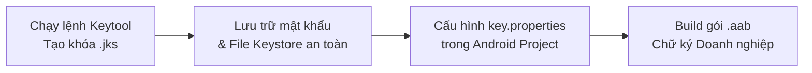
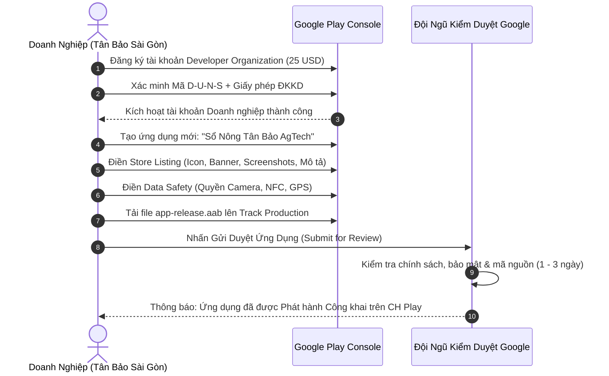

# CẨM NANG HƯỚNG DẪN XUẤT BẢN MOBILE APP, CHỮ KÝ SỐ THƯƠNG HIỆU & ĐĂNG KÝ BẢN QUYỀN PHÁP LÝ (GUIDE BUILD v1.0)
**Dự án:** Sổ Nông Tân Bảo AgTech (Plant Book Enterprise ERP v1.2.4)  
**Chủ sở hữu & Đơn vị phát triển:** CÔNG TY CỔ PHẦN TÂN BẢO SÀI GÒN (TBSG AgTech)  
**Tác giả kiến trúc:** Phạm Hoàng Phúc  
**Ngày ban hành:** 19/09/2026  

---

## 📑 MỤC LỤC TỔNG QUAN
1. [Phần 1: Tạo Chữ Ký Số Thương Hiệu (Release Keystore .jks)](#-phần-1-tạo-chữ-ký-số-thương-hiệu-release-keystore-jks)
2. [Phần 2: Cấu Hình Tự Động Ký Số & Xuất Bản Gói Android App Bundle (.aab)](#-phần-2-cấu-hình-tự-động-ký-số--xuất-bản-gói-android-app-bundle-aab)
3. [Phần 3: Quy Trình Đăng Ký Tài Khoản & Xuất Bản App Lên CH Play (Google Play Store)](#-phần-3-quy-trình-đăng-ký-tài-khoản--xuất-bản-app-lên-ch-play-google-play-store)
4. [Phần 4: Hướng Dẫn Đăng Ký Mã Số Định Danh Toàn Cầu D-U-N-S](#-phần-4-hướng-dẫn-đăng-ký-mã-số-định-danh-toàn-cầu-d-u-n-s)
5. [Phần 5: Quy Trình Đăng Ký Bảo Hộ Thương Hiệu (Trademark) & Bản Quyền Tác Giả (Copyright)](#-phần-5-quy-trình-đăng-ký-bảo-hộ-thương-hiệu-trademark--bản-quyền-tác-giả-copyright)
6. [Phần 6: Bảng Check-list & Lộ Trình Triển Khai Thực Tế](#-phần-6-bảng-check-list--lộ-trình-triển-khai-thực-tế)

---

## 🔑 PHẦN 1: TẠO CHỮ KÝ SỐ THƯƠNG HIỆU (RELEASE KEYSTORE .jks)

Khi phát hành phiên bản chính thức (Production), Google bắt buộc ứng dụng phải được ký bằng **Release Keystore chính chủ của Doanh nghiệp** (thay cho khóa debug mặc định).



### 1.1 Lệnh Tạo File Keystore Chuẩn Doanh Nghiệp
Mở terminal PowerShell trên máy tính và chạy lệnh sau (chú ý sửa mật khẩu theo ý bạn):

```powershell
keytool -genkey -v -keystore "mobile_app\android\app\tanbao-release-key.jks" -storetype JKS -keyalg RSA -keysize 2048 -validity 10000 -alias tanbao_key -dname "CN=Pham Hoang Phuc, OU=AgTech Division, O=CONG TY CO PHAN TAN BAO SAI GON, L=Ho Chi Minh, ST=Ho Chi Minh, C=VN"
```

### 1.2 Giải Thích Các Tham Số Cốt Lõi:
* `-keystore`: Vị trí và tên file khóa lưu trữ (`tanbao-release-key.jks`).
* `-alias`: Tên định danh của khóa ký (`tanbao_key`).
* `-validity 10000`: Thời hạn hiệu lực của khóa là 10.000 ngày (~27 năm).
* `-dname`: Thông tin định danh thương hiệu pháp lý của công ty:
  - `CN` (Common Name): Phạm Hoàng Phúc (Người đại diện kỹ thuật).
  - `OU` (Organizational Unit): AgTech Division (Bộ phận Công nghệ Nông nghiệp).
  - `O` (Organization): CONG TY CO PHAN TAN BAO SAI GON.
  - `L` (Locality): Ho Chi Minh City.
  - `C` (Country): VN.

> [!CAUTION]
> **QUY TẮC BẢO MẬT SỐ 1:**
> Hãy sao lưu file `tanbao-release-key.jks` và mật khẩu vào ít nhất 2 nơi an toàn (Google Drive công ty, USB bảo mật). **Nếu mất file này, bạn sẽ không thể đẩy các bản cập nhật app sau này lên CH Play được nữa.**

---

## 🛠️ PHẦN 2: CẤU HÌNH TỰ ĐỘNG KÝ SỐ & XUẤT BẢN GÓI ANDROID APP BUNDLE (.aab)

### 2.1 Cấu Hình File `key.properties`
Trong thư mục `mobile_app/android/`, tạo file có tên `key.properties` (được bảo vệ không bị commit lên GitHub qua `.gitignore`):

```properties
keyAlias=tanbao_key
keyPassword=Mat_Khau_Ban_Vua_Dat@2026
storePassword=Mat_Khau_Ban_Vua_Dat@2026
storeFile=tanbao-release-key.jks
```

### 2.2 Cấu Hình Gradle (`mobile_app/android/app/build.gradle.kts`)
Hệ thống đã tự động tích hợp cấu hình nạp `key.properties` khi build release:

```kotlin
val keystorePropertiesFile = rootProject.file("key.properties")
val keystoreProperties = java.util.Properties()
if (keystorePropertiesFile.exists()) {
    keystoreProperties.load(java.io.FileInputStream(keystorePropertiesFile))
}

signingConfigs {
    create("release") {
        if (keystorePropertiesFile.exists()) {
            keyAlias = keystoreProperties["keyAlias"] as String?
            keyPassword = keystoreProperties["keyPassword"] as String?
            storeFile = keystoreProperties["storeFile"]?.let { file(it) }
            storePassword = keystoreProperties["storePassword"] as String?
        }
    }
}

buildTypes {
    release {
        if (keystorePropertiesFile.exists() && keystoreProperties["keyAlias"] != null) {
            signingConfig = signingConfigs.getByName("release")
        } else {
            signingConfig = signingConfigs.getByName("debug")
        }
        isMinifyEnabled = false
        isShrinkResources = false
    }
}
```

### 2.3 Lệnh Xuất Bản Gói AAB Cho CH Play
Chạy các lệnh sau trong thư mục `mobile_app/`:

```bash
# 1. Dọn dẹp cache build cũ
flutter clean

# 2. Cài đặt đầy đủ dependencies
flutter pub get

# 3. Biên dịch gói Android App Bundle chính thức
flutter build appbundle --release
```

* **Vị trí file đầu ra thành phẩm:**  
  `mobile_app/build/app/outputs/bundle/release/app-release.aab`
* File này đã được đóng gói và ký bằng chứng chỉ số của **Tân Bảo Sài Gòn**, sẵn sàng tải lên Google Play Console.

---

## 🚀 PHẦN 3: QUY TRÌNH ĐĂNG KÝ TÀI KHOẢN & XUẤT BẢN APP LÊN CH PLAY (GOOGLE PLAY STORE)



### 3.1 Đăng Ký Tài Khoản Google Play Console (Doanh Nghiệp)
1. Truy cập: [https://play.google.com/console/signup](https://play.google.com/console/signup)
2. Chọn loại tài khoản: **Organization (Tổ chức / Doanh nghiệp)**.
3. Thanh toán phí đăng ký 1 lần duy nhất: **25 USD** (bằng thẻ Visa/Mastercard Doanh nghiệp hoặc cá nhân đại diện).

### 3.2 Chuẩn Bị Bộ Tài Liệu Đồ Họa (Store Assets)
| Tài Nguyên Đồ Họa | Kích Thước Bắt Buộc | Định Dạng | Mô Tả Yêu Cầu |
| :--- | :--- | :---: | :--- |
| **App Icon** | `512 x 512 px` | PNG 32-bit | Logo Sổ Nông Tân Bảo nền trong suốt/bo góc |
| **Feature Graphic** | `1024 x 500 px` | JPG / PNG | Banner quảng bá phong cách Nông nghiệp Hoàng Gia |
| **Phone Screenshots** | `1080 x 1920 px` hoặc `1080 x 2400 px` | JPG / PNG | Tối thiểu 4 ảnh chụp thực tế (Trang chủ, GIS, Nhật ký, Kho ERP) |

### 3.3 Khai Báo Chính Sách & An Toàn Dữ Liệu (Data Safety)
* **Camera:** Khai báo phục vụ *Quét mã QR Code cây trồng* và *Chụp ảnh nhãn bao bì phân thuốc (OCR)*.
* **NFC:** Khai báo phục vụ *Định danh cây trồng và đọc ghi thẻ NTAG213 ngoài vườn*.
* **Location (GPS):** Khai báo phục vụ *Định vị không gian GIS và vẽ ranh giới lô vườn*.
* **Privacy Policy Link (Chính sách quyền riêng tư):** Cung cấp đường link công khai (Ví dụ: `https://tanbaosaigon.com/privacy-policy`).

### 3.4 Tải File `.aab` & Gửi Duyệt
1. Vào mục **Release** $\rightarrow$ **Production** $\rightarrow$ Chọn **Create new release**.
2. Kéo thả file `app-release.aab`.
3. Nhập Release Name: `1.2.4 (8)`.
4. Nhập Release Notes:
   ```text
   - Ra mắt phiên bản 1.2.4: Buồng điều hành Nông nghiệp Hoàng Gia cao cấp.
   - Tích hợp không gian GIS Vệ tinh, quét thẻ thông minh NFC NTAG213.
   - Nhận diện nhãn thuốc bảo vệ thực vật qua OCR và Trợ lý AI Bé Mầm.
   ```
5. Nhấn **Save** $\rightarrow$ **Review release** $\rightarrow$ **Start rollout to Production**.
6. Thời gian duyệt: **1 - 3 ngày làm việc**.

---

## 🌐 PHẦN 4: HƯỚNG DẪN ĐĂNG KÝ MÃ SỐ ĐỊNH DANH TOÀN CẦU D-U-N-S

Google Play và Apple bắt buộc tài khoản Doanh nghiệp phải có **Mã D-U-N-S (Dun & Bradstreet Number - 9 chữ số)** để xác minh tính hợp pháp của tổ chức.

### Các Bước Đăng Ký Miễn Phí:
1. Truy cập cổng cấp mã D-U-N-S miễn phí của Dun & Bradstreet:  
   [https://www.dnb.com/duns-number/get-a-duns.html](https://www.dnb.com/duns-number/get-a-duns.html)
2. Điền thông tin pháp nhân:
   - **Tên công ty:** `CONG TY CO PHAN TAN BAO SAI GON` (hoặc `TAN BAO SAI GON JOINT STOCK COMPANY`).
   - **Mã số thuế (Tax ID):** Điền đúng theo Giấy phép ĐKKD.
   - **Địa chỉ trụ sở chính:** Điền tiếng Anh / tiếng Việt không dấu khớp 100% với ĐKKD.
   - **Email công ty:** Nên dùng email theo tên miền doanh nghiệp (Ví dụ: `contact@tanbaosaigon.com`).
3. Sau **3 - 7 ngày làm việc**, D&B sẽ gửi mã số D-U-N-S 9 chữ số về email của bạn mà **không mất phí**.
4. Sử dụng mã này để hoàn tất xác minh trên Google Play Console.

---

## 🏛️ PHẦN 5: QUY TRÌNH ĐĂNG KÝ BẢO HỘ THƯƠNG HIỆU (TRADEMARK) & BẢN QUYỀN TÁC GIẢ (COPYRIGHT)

Để bảo vệ tài sản trí tuệ của Tân Bảo Sài Gòn trước pháp luật Việt Nam và quốc tế, cần thực hiện 2 thủ tục đăng ký độc lập:

---

### 5.1 Đăng Ký Bảo Hộ Nhãn Hiệu (Trademark) Tại Cục Sở Hữu Trí Tuệ (IP Viet Nam)
* **Đối tượng bảo hộ:** Tên gọi **"Plant Book"**, **"Tân Bảo AgTech"** và **Logo biểu trưng**.
* **Cơ quan giải quyết:** Cục Sở hữu trí tuệ Việt Nam (Hà Nội, TP.HCM, Đà Nẵng) hoặc nộp online tại [https://dvctt.ipvietnam.gov.vn/](https://dvctt.ipvietnam.gov.vn/).
* **Phân nhóm sản phẩm/dịch vụ theo Thỏa ước Nice:**
  - **Nhóm 09:** Phần mềm ứng dụng trên máy tính và điện thoại di động; phần mềm quản lý nhật ký canh tác nông nghiệp thông minh; thiết bị cảm biến IoT và đầu đọc thẻ NFC.
  - **Nhóm 42:** Dịch vụ phần mềm dạng dịch vụ (SaaS); thiết kế, phát triển và lưu trữ cơ sở dữ liệu nông nghiệp số trên đám mây.
  - **Nhóm 44:** Dịch vụ tư vấn kỹ thuật nông nghiệp, quản lý quy trình canh tác đạt chuẩn VietGAP/GlobalGAP.
* **Hồ sơ gồm:**
  1. 02 Tờ khai đăng ký nhãn hiệu (Mẫu 04-NH).
  2. 05 Mẫu nhãn hiệu kích thước $80 \times 80\text{ mm}$.
  3. Bản sao Giấy chứng nhận Đăng ký Doanh nghiệp (sao y công chứng).
  4. Chứng từ nộp phí, lệ phí nhà nước.
* **Thời gian thẩm định:**
  - Thẩm định hình thức: 01 tháng.
  - Công bố đơn trên Công báo: 02 tháng.
  - Thẩm định nội dung: 09 - 12 tháng.
  - Cấp Bằng độc quyền nhãn hiệu: Hiệu lực 10 năm (gia hạn liên tục mỗi 10 năm).

---

### 5.2 Đăng Ký Quyền Tác GiẢ Đối Với Phần Mềm Máy Tính (Copyright)
* **Đối tượng bảo hộ:** Mã nguồn toàn bộ hệ thống (Source Code Backend, Frontend Web, Flutter Mobile App, Database Schema).
* **Cơ quan giải quyết:** Cục Bản quyền tác giả (Bộ Văn hóa, Thể thao và Du lịch).
* **Hồ sơ gồm:**
  1. Tờ khai đăng ký quyền tác giả đối với tác phẩm phần mềm máy tính.
  2. 02 Đĩa CD / USB ghi toàn bộ source code của dự án.
  3. 02 Bản in đóng cuốn: 25 trang đầu + 25 trang cuối của mã nguồn + Tài liệu hướng dẫn sử dụng / đặc tả kiến trúc hệ thống.
  4. Giấy cam đoan của tác giả phát triển (Phạm Hoàng Phúc).
  5. Văn bản phân công nhiệm vụ hoặc chuyển nhượng quyền sở hữu sang Công ty Cổ phần Tân Bảo Sài Gòn.
  6. Bản sao công chứng Giấy phép ĐKKD và CCCD của tác giả.
* **Thời hạn cấp Giấy chứng nhận:** Nhanh chóng chỉ từ **15 - 20 ngày làm việc**.

---

## 📊 PHẦN 6: BẢNG CHECK-LIST & LỘ TRÌNH TRIỂN KHAI THỰC TẾ

| Giai Đoạn | Hạng Mục Công Việc | Thời Gian Thực Hiện | Người Phụ Trách | Kết Quả Nghiệm Thu |
| :---: | :--- | :---: | :---: | :--- |
| **Giai đoạn 1** | Chạy lệnh `keytool` tạo file `tanbao-release-key.jks` & cấu hình `key.properties` | 15 Phút | Kỹ thuật (Dev) | Có file chứng chỉ số thương hiệu |
| **Giai đoạn 2** | Chạy `flutter build appbundle --release` | 10 Phút | Kỹ thuật (Dev) | Xuất ra file `app-release.aab` |
| **Giai đoạn 3** | Đăng ký mã D-U-N-S Doanh nghiệp tại Dun & Bradstreet | 3 - 5 Ngày | Pháp lý / Kỹ thuật | Nhận mã D-U-N-S 9 chữ số qua email |
| **Giai đoạn 4** | Đăng ký tài khoản Google Play Console Organization (25 USD) | 1 Ngày | Kế toán / Kỹ thuật | Kích hoạt Developer Account chính thức |
| **Giai đoạn 5** | Tải Store Assets, Data Safety & file `.aab` lên Production | 1 Ngày | Kỹ thuật (Dev) | Đưa vào hàng đợi xét duyệt Google |
| **Giai đoạn 6** | Google kiểm duyệt và phát hành | 1 - 3 Ngày | Google Review Team | **App chính thức xuất hiện trên CH Play** |
| **Giai đoạn 7** | Nộp hồ sơ Đăng ký Quyền Tác Giả Phần Mềm & Nhãn Hiệu Độc Quyền | 15 - 30 Ngày | Pháp lý Doanh nghiệp | **Sở hữu Giấy chứng nhận bản quyền Nhà nước** |

---

> [!TIP]
> Toàn bộ mã nguồn, cấu hình `key.properties.example`, `.gitignore` và quy chuẩn build đã được đồng bộ sẵn sàng tại kho Git:  
> [https://github.com/Phuc0901-pp/plant-book.git](https://github.com/Phuc0901-pp/plant-book.git)
